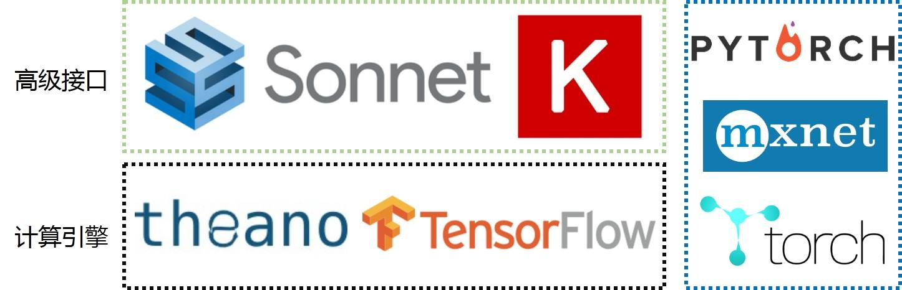

# 深度学习-14：知名的深度学习开源架构和项目

> [深度学习原理与实践(开源图书)-总目录](https://blog.csdn.net/shareviews/article/details/83040730)

人工智能artificial intelligence，AI是科技研究中最热门的方向之一。像IBM、谷歌、微软、Facebook 和亚马逊等公司都在研发上投入大量的资金、或者收购那些在机器学习、神经网络、自然语言和图像处理等领域取得了进展的初创公司。考虑到人们对此感兴趣的程度，我们将不会惊讶于斯坦福的专家在人工智能报告中得出的结论：“越来越强大的人工智能应用，可能会对我们的社会和经济产生深远的积极影响，这将出现在从现在到 2030 年的时间段里。”

知名的深度学习开源架构和项目，见下图。

## 1 Tensoerflow

[TensorFlow](http://www.tensorflow.org)是谷歌基于DistBelief进行研发的第二代人工智能学习系统。TensorFlow 表达了高层次的机器学习计算，大幅简化了第一代系统，并且具备更好的灵活性和可延展性。TensorFlow一大亮点是支持异构设备分布式计算，它能够在各个平台上自动运行模型，从手机、单个CPU / GPU到成百上千GPU卡组成的分布式系统。从目前的文档看，TensorFlow支持CNN、RNN和LSTM算法，这都是目前在Image，Speech和NLP最流行的深度神经网络模型。它拥有深厚的灵活性、真正的可移植性、自动微分功能，并且支持 Python 和 c++。它的网站拥有十分详细的教程列表来帮助开发者和研究人员沉浸于使用或扩展他的功能。TensorFlow 最初由Google大脑小组（隶属于Google机器智能研究机构）的研究员和工程师们开发出来，用于机器学习和深度神经网络方面的研究，但这个系统的通用性使其也可广泛用于其他计算领域。

Tensoerflow支持的高级特性：

- 高度的灵活性:通过构件计算图能实现任意目的的计算
- 高可移植性(Portability):Tensorflow 在CPU和GPU上运行，比如说可以运行在台式机、服务器、手机移动设备等等。
- 将科研和产品联系在一起
- 自动求微分:基于梯度的机器学习算法会受益于Tensorflow自动求微分的能力。
- 多语言支持:Tensorflow 有一个合理的c++使用界面，也有一个易用的python使用界面来构建和执行你的graphs。
- 性能最优化:由于Tensorflow 给予了线程、队列、异步操作等以最佳的支持，能发挥硬件全部潜能。 

Tensorflow的原理和架构，见下图。

## 2 PyTorch(Caffe2)

[PyTorch(Caffe2)](https://pytorch.org) 通过混合前端，分布式训练以及工具和库生态系统实现快速，灵活的实验和高效生产。PyTorch 和 TensorFlow 具有不同计算图实现形式，TensorFlow 采用静态图机制(预定义后再使用)，PyTorch采用动态图机制(运行时动态定义)。PyTorch具有以下高级特征：

- 混合前端:新的混合前端在急切模式下提供易用性和灵活性，同时无缝转换到图形模式，以便在C ++运行时环境中实现速度，优化和功能。
- 分布式训练:通过利用本地支持集合操作的异步执行和可从Python和C ++访问的对等通信，优化了性能。
- Python优先: PyTorch为了深入集成到Python中而构建的，因此它可以与流行的库和Cython和Numba等软件包一起使用。
- 丰富的工具和库:活跃的研究人员和开发人员社区建立了丰富的工具和库生态系统，用于扩展PyTorch并支持从计算机视觉到强化学习等领域的开发。
- 本机ONNX支持:以标准ONNX（开放式神经网络交换）格式导出模型，以便直接访问与ONNX兼容的平台，运行时，可视化工具等。
- C++前端：C++前端是PyTorch的纯C++接口，它遵循已建立的Python前端的设计和体系结构。它旨在实现高性能，低延迟和裸机C++应用程序的研究。

## 3 Mxnet

[Apache MXNet](http://mxnet.incubator.apache.org)是一个为提高效率和灵活性而设计的深度学习框架。它允许您混合符号和命令式编程来最大限度地提高效率和生产力。在其核心，MXNet包含一个动态的依赖调度程序，可自动并行处理符号操作和命令操作。顶层的图形优化层使得符号执行更加快速和高效。MXNet是便携式和轻量级的，可以有效扩展到多个GPU和多台机器。MXNet不仅仅是一个深入的学习项目。这也是建立深度学习系统的蓝图和指南的集合 ，以及针对黑客的DL系统的有趣见解。

MXNet支持的高级特性：

- 设计笔记提供有用的见解，可供其他DL项目重复使用
- 灵活配置任意计算图
- 混合和匹配命令式和符号式编程来最大限度地提高灵活性和效率
- 轻便，高效的内存和便携式智能设备
- 采用自动并行处理功能扩展到多GPU和分布式设置
- 支持Python，R，Scala，C ++和Julia
- 云环境友好并直接与S3，HDFS和Azure兼容  

## 4 Mahout

[Mahout](http://mahout.apache.org)是Apache基金会旗下的一个开源机器学习框架。Mahout提供一些可扩展的机器学习领域经典算法的实现，旨在帮助开发人员更加方便快捷地创建智能应用程序。Mahout包含许多实现，包括聚类、分类、推荐过滤、频繁子项挖掘。使用 Mahout 的公司有 Adobe、埃森哲咨询公司、Foursquare、英特尔、领英、Twitter、雅虎和其他许多公司。其网站列了出第三方的专业支持。

## 5 MLlib

[Apache Spark](http://spark.apache.org/mllib)是最流行的大数据处理工具之一。MLlib是Spark的可扩展机器学习库。它集成了 Hadoop 并可以与 NumPy 和 R 进行交互操作。它包括了许多机器学习算法如分类、回归、决策树、推荐、集群、主题建模、功能转换、模型评价、ML 管道架构、ML 持久、生存分析、频繁项集和序列模式挖掘、分布式线性代数和统计。

## 6 OpenNN

[OpenNN](http://www.opennn.net)作为一个为开发者和科研人员设计的具有高级理解力的人工智能，OpenNN 是一个实现神经网络算法的 c++ 编程库。它的关键特性包括深度的架构和快速的性能。其网站上可以查到丰富的文档，包括一个解释了神经网络的基本知识的入门教程。OpenNN 的付费支持由一家从事预测分析的西班牙公司 Artelnics 提供。

## 7 Scikits-Learn

[Scikits-Learn](http://scikit-learn.org)是一个开源的、构建在SciPy之上用于机器学习的 Python 模块。它包括简单而高效的工具，可用于数据挖掘和数据分析，适合于任何人，可在各种情况下重复使用、构建在 NumPy、SciPy和 matplotlib 之上，遵循BSD 协议。

## 系列文章

- [深度学习原理与实践(开源图书)-总目录](https://blog.csdn.net/shareviews/article/details/83040730)
- [机器学习原理与实践(开源图书)-总目录](https://blog.csdn.net/shareviews/article/details/83030331)
- [Github: 机器学习&深度学习理论与实践(开源图书)](https://github.com/media-tm/MTOpenML)

## 参考文献

- [1] Ian Goodfellow, Yoshua Bengio. [Deep Learning](http://www.deeplearningbook.org/). MIT Press. 2016.
- [2] 焦李成等. 深度学习、优化与识别. 清华大学出版社. 2017.
- [3] 佩德罗·多明戈斯. 终极算法-机器学习和人工智能如何重塑世界. 中信出版社. 2018.
- [4] 雷.库兹韦尔. 人工智能的未来-揭示人类思维的奥秘.  浙江人民出版社. 2016.