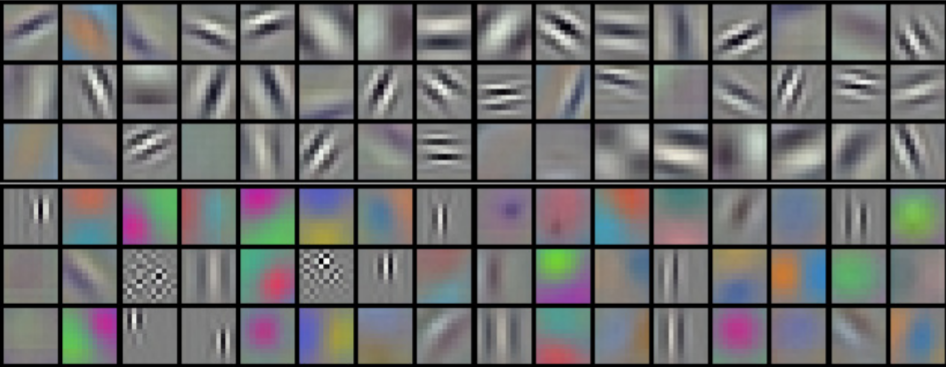
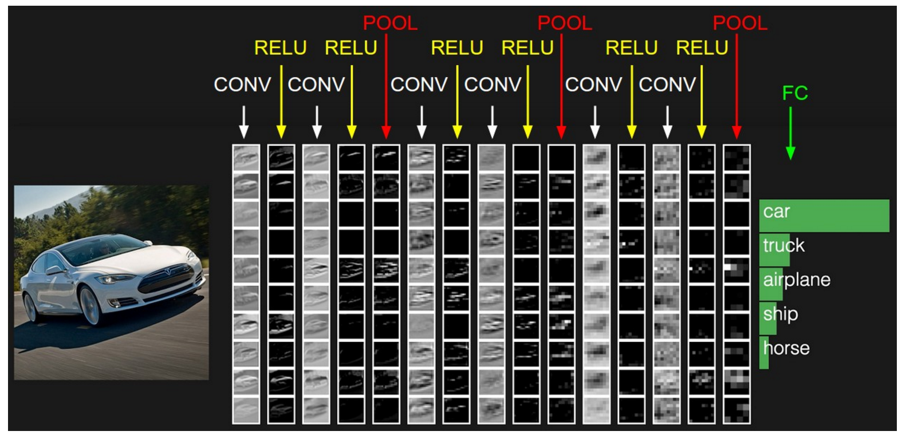
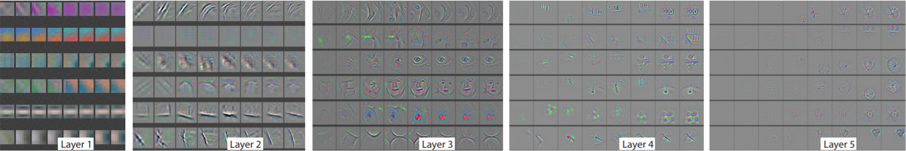

# 打开深度学习的潘多拉魔盒(模型可视化)

> [深度学习原理与实践(开源图书)-总目录](https://blog.csdn.net/shareviews/article/details/83040730),建议收藏，告别碎片阅读!

深度学习在各个领域攻城略地，在诸多领域秒杀传统算法，但是其运作细节一直是个黑盒。理论研究者特别是数学家无法完全解释的事物。学术界、研究所和企业界纷纷希望搞出工具箱，希望打开这个潘多拉魔盒，一窥究竟。总体上有两个目标: (1) 量化和图形化其运行机理；(2) 使从业者有更多的Insight,能够更好的知道深度学习实践，并降低深度学习的门槛。社会变化快，天天潘多拉(Pandora)魔盒满天飞，重温一下潘多拉(Pandora)的故事，貌似还是蛮温情的(:>...)

> 众神之王宙斯对普罗米修斯造人以及盗取火种之事耿耿于怀，于是命令赫淮斯托斯用黏土做成的第一个人类女人来报复和惩戒普罗米修斯。众神听从宙斯命令各给了女人一份礼物：阿佛洛狄忒(Aphrodite)为她淋上令男人疯狂的激素；赫拉赐予她好奇心(curiosity)；女神雅典娜(Athena)给了她无知(not wisdom)，并教女人织布，制造出各颜各色的美丽衣织，使女人看来更加鲜艳迷人；神的使者赫尔墨斯(Hermes)传授她语言的天赋，即说谎的天赋；宙斯给其赐名: 潘多拉(Pandora)。根据神话，潘多拉打开魔盒，释放出人世间的所有邪恶——贪婪、虚伪、诽谤、嫉妒、痛苦等等，但潘多拉却照众神之王宙斯的旨意趁希望没有来得及释放时，又盖上了盒盖，最后把它永远锁在盒内。后来潘多拉(Pandora)泛指灾祸之源。

## 1 模型可视化概述

可视化工作分为两大类：非参数化方法和参数法方法。非参数化方法不分析卷积核具体的参数，而是先选取图片库，然后将图片在已有模型中进行一次前向传播，对某个卷积核，我们使用对其响应最大的图片块来对之可视化。参数法方法着重分析卷积核中的参数，使用参数重构出图像。

## 2 模型可视化

深度学习里面大部分都是对若干维度的数据进行卷积操作。理解卷积操作的关键是理解中间层的特征激活值。特征激活值和图像是反卷积的关系，利用反卷积操作可以完成反向映射操作。反卷积网络可以被看成是一个卷积模型，这个模型使用和卷积同样的组件(过滤和池化)，但是却是相反的过程。反卷积网络用来可视化已经训练好的卷积神经网络，所以此处的反卷积网络并不要求具有学习能力。

### 2.1 卷积核(Filters)可视化

Krizhevsky凭借AlexNet模型，基于深度神经网络一举赢得2012年度ImageNet大规模图像识别挑战赛(ILSVRC)冠军。这次突破客观上推动了卷积神经网络的复兴。Krizhevshy再其论文中直接可视化了第一个卷积层的卷积核。从卷积核的可视化的观察可以发现:卷积核相当于特征提取器，一个特征提取器用于提取一个特征，所需每个卷积层需要多个卷积核(特征提取器)。如下图所示:

图片来源: [AlexNet论文-NIPS](www.image-net.org/challenges/LSVRC/2012/supervision.pdf)

深度神经网络所有卷积层的卷积核都可以可视化。所有卷积层的卷积核可视化的观察可以发现：低级卷积层提取低级特征(点线面等)，中级卷积层提取中级特征(形状等)，高级卷积层提取高级特征(抽象特征)。这种分层特征提取又直接证明了深度学习的多层卷积操作等效于大脑皮层处理视觉信息时的分层处理机制(V1-V5)；间接证明了深度学习是类似人脑的智能算法。如下图所示:

图片来源: [CS231n: Convolutional Neural Network](http://cs231n.github.io/convolutional-networks/)

### 2.2 特征激活值可视化(基于反卷积)

卷积核可视化对于理解神经网络模型并不是非常直接，所以Matthew D Zeiler提出使用特征激活值可视化的方法可视化卷积层。Matthew D Zeiler利用这种可视化手段，成功用于可视化和优化AlexNet模型，并提出ZFNet模型，赢得了2013年度ImageNet大规模图像识别挑战赛(ILSVRC)的冠军。

图片来源: [ZFNet论文-1311.2901](https://arxiv.org/abs/1311.2901)

### 2.3 特征映射(Feature Maps)可视化

将卷积层的 filters 和 feature maps 当成图片可视化有两个意义: (1) 特征平滑规律的 filters 是模型训练良好的标志之一，未收敛或过拟合模型的卷积层 filters 会出现很多 noise。(2) 观察 filters 和 feature maps 的图片，特别是第一层卷积的图片可以总结出该层所关注的图片特征，这有助于我们理解卷积神经网络的工作原理。[reminisce/mxboard-demo](https://github.com/reminisce/mxboard-demo)给我们展现了深度学习可视化的各种技巧。对于良好的模型，其Filters都表现出良好的光滑性和规律性，彩色Filters负责提取原始图片前景和背景的局部特征，灰白图片负责提取图片中物体的轮廓特征。 MXNet Model Zoo 中VGG16模型的特征映射(Feature Maps)可视化效果如下:

图片来源: [reminisce/mxboard-demo](https://github.com/reminisce/mxboard-demo)

## 3 代码实现

代码实现请参考下面代码。目前可视化工具箱基本满足需求，了解基本原理即可使用。前面两个项目是演示性项目，代码很容易学习和理解。后面两个项目是百度和谷歌的可视化工具箱，看源码就免了，学会使用就可以了。

- [reminisce/mxboard-demo](https://github.com/reminisce/mxboard-demo)
- [yosinski/deep-visualization-toolbox](https://github.com/yosinski/deep-visualization-toolbox)
- [Paddle/Visual DL](https://github.com/PaddlePaddle/VisualDL/)
- [tensorflow/tensorboard](https://github.com/tensorflow/tensorboard)

## 4 经典参考案例

Yosinski[4]开发一个可以支持任意CNN模型可视化的框架，项目名称: [yosinski/deep-visualization-toolbox](https://github.com/yosinski/deep-visualization-toolbox)。目前支持Caffee框架，其他框架估计需要进一步扩展。可视化效果非常惊艳。

清华大学视觉分析小组提供了一个在线的CNN可视化工具[CNNVis](http://shixialiu.com/publications/cnnvis/demo/)，帮忙初学者更好地分析深度卷积神经网络。大家可以在训练的时候采取不同的卷积核尺寸和个数对照来看训练的中间过程。

百度PaddlePaddle& ECharts团队宣布上线深度学习可视化工具[Visual DL](https://github.com/PaddlePaddle/VisualDL/)，该工具可以使得深度学习任务变得生动形象，实现可视分析。百度希望能够借此为全球更广泛的用户提供更便捷高效的深度学习工具。

Tensorflow官方推出了可视化工具Tensorboard，可它可以将模型训练过程中的各种数据汇总起来存在自定义的路径与日志文件中，然后在指定的web端可视化地展现这些信息。Tensorboard可以记录与展示以下数据形式：Scalars, Images, 音频Audio, Graph, Distribution, Histograms, Embeddings等。在训练的过程中将一些信息加以记录并可视化得表现出来，有助于我们理解和探索我们设计的深度学习模型。

## 参考论文

- [1] Dumitru Erhan, Yoshua Bengio. Visualizing Higher-Layer Features of a Deep Network. 2009.
- [2] Matthew D Zeiler, Rob Fergus. Visualizing and understanding convolutional neural networks. arXiv preprint arXiv:1311.2901, 2013.
- [3] Matthew D Zeiler, Rob Fergus. Adaptive deconvolutional networks for mid and high level feature learning. In: ICCV (2011)
- [4] J. Yosinski, J. Clune, A. M. Nguyen, T. Fuchs, and H. Lipson, “Understanding neural networks through deep visualization,” CoRR, vol. abs/1506.06579, 2015.