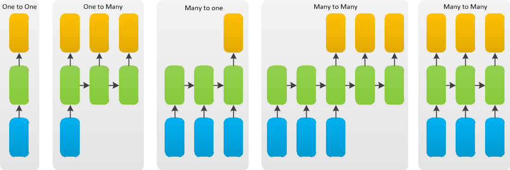

# 深度学习-41: 深度循环神经网络(Recurrent NN, RNN)

> [深度学习原理与实践(开源图书)-总目录](https://blog.csdn.net/shareviews/article/details/83040730)

在图像分类和目标识别领域，基于前馈神经网络的深度学习模型表现优异，但是在语音识别和自然语音处理领域深度学习模型水土不服，时间序列数据存在时间关联性和整体逻辑特性。深度学习模型无法利用历史数据的时间依赖关系，来分析数据特征，故而无法处理时间序列数据。计算机科学家借鉴大脑处理时序数据的模式，改造了深度学习模型，提出了循环神经网络模型。循环神经网络模型在隐层引入了定向循环，它能更好的表征高纬度信息的整体逻辑性。

递归神经网络(Recursive NN, RNN)和循环神经网络(Recurrent NN, RNN)均可以理解为递归神经网络。递归神经网络属于时间递归神经网络；循环神经网络属于结构递归神经网络。RNN通常是指循环神经网络，我们可以将递归神经网络看做是循环神经网络的一种泛化。

## 1 RNN简史

- 1982年，约翰·霍普菲尔德提出Hopfiled网络，网络内部有反馈连接，能够处理信号中的时间依赖性；
- 1986年，Michael Jordan 在神经网络中引入循环连接；
- 1990年，Jeffrey Elman 正式提出了RNN模型，RNN具备有限短期记忆；(利用反向传播和梯度下降算法过程中遭受到了严重的梯度消失问题)
- 1997年，Sepp Hochreiter提出长短期记忆(Long short-term memory)网络模型；
- 2003年，Yoshua Bengio基于RNN的N元统计模型，解决了分词特征表征和维度魔咒问题。
- 2010年以后，循环神经网络(RNN)/卷积神经网络（CNN）/深度信念网络（DBN）成为深度学习的三个模型。并诞生了很多智能语音应用(SIRI,Alexa...)。

## 2 RNN的生物机理

时间认知和目标导向在人脑处理语音识别和自然语音处理活动时显然非常重要。“书读百遍，其义自见”，“一回生二回熟”，“失败是成功母”等俗语均能发现时间认知和目标导向在人脑处理信息时的作用。历史信息经过强化叠加，逐渐沉淀下来，最终成为我们的经验知识，经验知识和上下文场景在某些场合可能比真实输入数据还要重要。RNN通过使用带有自反馈的神经元，能够处理理论上任意长度的（存在时间关联性的）序列数据。相比于传统的前馈神经网络，它更符合生物神经元的连接方式，更符合人类大脑处理信息的工作模式。

## 3 循环神经网络(Recurrent Neural Network)

时间序列数据存在时间关联性和整体逻辑特性，传统神经网络信息是单向传播的(误差反向传播不改变单向性)，循环神经网络(RNN)将输出层的结果再次输入到隐藏层，以其能够发现时间序列数据的时间关联性和整体逻辑特性等高维度信息。1990年，Jeffrey Elman正式提出了RNN模型，RNN具备有限短期记忆；1997年，Sepp Hochreiter提出长短期记忆(LSTM)网络模型。

Recurrent NN模型的创新:

- 循环神经网络(RNN)处理时间序列数据具有先天优势；
- 循环神经网络(RNN)通过反向传播和梯度下降算法达到了纠正错误的能力，但未解决梯度消失问题；
- 直到1997年，循环神经网络(RNN)引入了一个基于LSTM的架构后，梯度消失问题得以解决；
- LSTM的架构中的单元相当于一个模拟计算机，显著提高了网络精度。

### 3.1 时间序列数据

常见的时间序列数据包括:语言模型、手写体识别、序列生成、机器翻译、语音、视频分析等。时间序列数据的样本间存在顺序关系，每个样本和它之前的样本存在关联；直白一点呢的表述也就是选择和决策参考了上一次的状态。RNN不仅能够处理序列的输入，也能得到序列的输出，这里的序列指的是向量序列。

假设时间序列为: $X\{x_1, x_2, \ldots, x_N\}$

时间序列模型为:$P(X)=\prod_{i=1}^N{P(x_i|x_1,\ldots,x_{i-1})}$

根据输出和输入序列不同数量rnn可以有多种不同的结构，不同结构自然就有不同的引用场合。每个矩形是一个向量；箭头代表函数(例如矩阵乘法)；红色的是输入向量；蓝色的是输出向量；绿色的是某一时间的RNN状态。如下图，

- 函数问题(不是序列): 一个输入得到一个输出，未体现序列的特征，例如:图像分类场景。
- 一到多: 给一个输入得到一系列输出，可用于生产图片描述的场景，例如:图像自动字幕，将一幅幅图像转化为句子输出。
- 多到一: 给一系列输入得到一个输出，可用于文本情感分析，对一些列的文本输入进行分类，看是消极还是积极情感，例如:情感分类，将一个给定的句子分类为积极的情感或者负面的情感
- 间隔多到多: 给一些列输入得到一系列输出，可用于翻译或聊天对话场景，对输入的文本转换成另外的文本，例如:机器翻译，RNN读入英语的句子，翻译出法语的句子
- 同步多到多: 它是经典的rnn结构，前一输入的状态会带到下一个状态中，而且每个输入都会对应一个输出，例如:视频分类，我们需要给视频的每一帧打标签。

### 3.2 模型的结构

和经典神经网络一样，循环神经网络(RNN)包含输入层，隐藏层和输出层；隐藏层分配了若干个权重矩阵，并利用优化函数(损失函数)按照一定优化条件定向优化，限定实际输出与目标输出之间的误差，最终计算出网络的权重矩阵。循环神经网络(RNN)引入了两个创新，(1) 即时输入和历史输入均分配权重，并通过优化函数确认最终的权重。(2) 引入了时间反向传播(BackPropagation Through Time，简称BPTT）。

循环神经网络(RNN)继承了常规的梯度下降算法优化网络模型，常用随机梯度下降算法等均可用于优化循环神经网络(RNN)模型。梯度下降算法通过放大多维误差或代价函数的局部最小值来打破维数灾难。

RNN与我们大脑神经元的工作方式更加的贴近，因为大脑的思考过程各个神经元是有相互间的交互的，但是以前的神经网络仅仅从一层到另外一层忽视了隐含层中神经元的复杂交互。在RNN中，神经元的输出可以在下一个时间戳直接作用到自身，即第i层神经元在m时刻的输入，除了(i-1)层神经元在该时刻的输出外，还包括其自身在(m-1)时刻的输出。

RNN在NLP中有广泛的应用，语言模型与文本生成(Language Modeling and Generating Text)，机器翻译(Machine Translation)，语音识别(Speech Recognition)，图像描述生成 (Generating Image Descriptions) 等。所有递归神经网络都具有神经网络重复模块链的形式。在标准RNN中，该重复模块将具有非常简单的结构，例如单个tanh层。为了分析方便，我们常将RNN在时序上展开，得到如下的结构：

 
图像来源:[colah blog](http://colah.github.io/)

### 3.3 模型的优化

RNN训练困难的主要原因在于隐藏层参数ww的传播：由于误差传播在展开后的RNN上，无论在前向传播过程还是在反向传播过程中ww都会乘上多次，这就导致：

- 梯度消失：如果梯度很小的话(<1)，乘上多次指数级下降，对输出几乎就没有影响了
- 梯度爆炸：反过来，如果梯度很大的话，乘上多次指数级增加，又导致了梯度爆炸

#### 1 通过时间的反向传播

经典神经网络使用著名的BP算法反向逐层回归优化网络模型，利用损失函数的偏导调整每个单元的权重。循环神经网络(RNN)使用新版本机制即时间的反向传播(BPTT),引入了记忆单元，历史时刻T-1/T-2的数据也参与计算，用以关注时间序列数据的 时间关联性和整体逻辑特性。当然记忆模块可以有多种变体，比如长时记忆、短时记忆和工作记忆，不一而足。

#### 2 梯度消失问题

初代的循环神经网络(RNN)获取了初步的成功，但是梯度消失问题像梦魇一样让其陷入研究的低谷。梯度可以视为斜率，梯度值就是优化指示器；梯度值越大，网络模型很快速收敛到最佳状态；梯度值平坦或微弱，网络优化就失去了优化目标，网络模型无法收敛到最佳状态，只能处于随机漫步状态。

### 3.4 长期依赖问题

对于看电影、写作或思考的场景来说，我们总会或多或少的记住前面的东西(短暂记忆或持久记忆)，然后旧的记忆和新的记忆反复叠加，最终我们完成了电影、写作或思考之旅。例如，我们看章子怡的电影《无问西东》，我们可以根据已经发生的故事情节推测当前故事情节的可能情节；或者我们的大脑会把所有已经发生的故事串起来，在某一刹那我们的泪如雨下。

传统的神经网络(串行的卷积网络)不能做到这一点，这似乎是一个主要的缺点。例如，假设您想要对电影中每个点发生的事件进行分类。目前尚不清楚传统神经网络如何利用其对电影中先前事件的推理来告知后者。循环神经网络解决了这个问题。它们是具有循环的网络，允许信息持续存在。由于独特的设计结构，LSTM特别适合于处理时序间隔和延迟非常长的任务，作为非线性模型，LSTM非常适合于构造更大型深度神经网络。

#### 1 短期依赖问题

时序数据(文本、音频或视频等)任务中，多数情况需要很多的上下文联系(甚至常识知识)才能准确预测。考虑尝试预测文本中的最后一个词“我在法国长大......我说流利的法语。”。最近的信息表明，下一个词可能是一种语言的名称，但如果我们想缩小哪种语言，我们需要从更进一步的背景来看，法国的背景。相关信息与需要变得非常大的点之间的差距完全是可能的。不幸的是，随着差距的扩大，RNN无法学会连接信息。

 
图像来源:[colah blog](http://colah.github.io/)

#### 2 长期依赖问题

RNN的优势是能够将先前信息连接到当前任务。我们只需要查看最近的信息来执行当前任务。如果相关信息与所需地点之间的差距很小，RNN可以学习使用过去的信息。例如: 考虑一种语言模型，试图根据之前的单词预测下一个单词。如果我们试图预测“云在天空中”的最后一个词，我们不需要任何进一步的背景 - 很明显，下一个词将是天空。

 
图像来源:[colah blog](http://colah.github.io/)

### 4 RNN代码示例

- [Predict stock market prices using RNN](https://github.com/lilianweng/stock-rnn)
- [word-rnn-tensorflow](https://github.com/hunkim/word-rnn-tensorflow)
- [Chinese Poetry Generation](https://github.com/Disiok/poetry-seq2seq)

### 5 扩展思考

5.1 LTSM的原理，LTSM对RNN的主要改进是什么？
5.2 请列举基于RNN/LTSM的流行产品或应用?
5.3 RNN/LTSM可以预测股票等金融数据吗？

## 系列文章

- [深度学习原理与实践(开源图书)-总目录](https://blog.csdn.net/shareviews/article/details/83040730)
- [机器学习原理与实践(开源图书)-总目录](https://blog.csdn.net/shareviews/article/details/83030331)
- [Github: 机器学习&深度学习理论与实践(开源图书)](https://github.com/media-tm/MTOpenML)

## 参考文献

- [1] Ian Goodfellow, Yoshua Bengio. [Deep Learning](http://www.deeplearningbook.org/). MIT Press. 2016.
- [2] 焦李成等. 深度学习、优化与识别. 清华大学出版社. 2017.
- [3] 佩德罗·多明戈斯. 终极算法-机器学习和人工智能如何重塑世界. 中信出版社. 2018.
- [4] 雷.库兹韦尔. 人工智能的未来-揭示人类思维的奥秘.  浙江人民出版社. 2016.