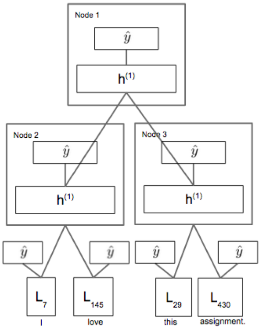

# 深度学习-42:深度递归神经网络(Recursive NN,RNN)

> [深度学习原理与实践(开源图书)-总目录](https://blog.csdn.net/shareviews/article/details/83040730)

递归神经网络(Recursive NN,RNN)通过带有树状相似的神经网络结构来递归复杂的深度网络。本质上，递归神经网络是对循环神经网络(Recurrent Neural Network)的一个有效扩展，他们具有不同的计算图。

递归神经网络(Recursive NN)和循环神经网络(Recurrent NN, RNN)统称为递归神经网络(RNN)。循环神经网络(Recurrent Neural Network, RNN)属于时间递归神经网络，时间递归神经网络的神经元间连接构成矩阵; 递归神经网络(Recursive NN)属于结构递归神经网络，结构递归神经网络利用相似的神经网络结构递归构造更为复杂的深度网络。递归神经网络(RNN)无法处理随着递归，权重指数级爆炸或消失的问题(Vanishing gradient problem)，难以捕捉长期时间关联。

RNN通常是指循环神经网络，我们可以将递归神经网络看做是循环神经网络的一种泛化。

## 1 RNN网络的创新

递归神经网络(RNN)包括一层内的加权连接(与传统前馈网络相比，连接仅馈送到后续层)。因为RNN包含循环，所以它们可以在处理新输入的同时存储信息。这种记忆使它们非常适合处理必须考虑事先输入的任务(比如时间序列数据)。递归神经网络(RNN)非常适合处理文本、语音、视频等时间序列数据样本。

递归神经网络是循环神经网络的泛化，递归神经网络的计算图结构为1个深层树，而不是RNN的链式结构。

## 2 RNN网络的结构

递归神经网络(Recursive NN)和循环神经网络(Recurrent NN)都可以处理时间序列数据。但是递归神经网络(Recursive NN)在基于词嵌入和句子的连续表示、自然场景图像和自然语言处理中的学习时序和树结构方面表现突出。

### 2.1 时间序列数据

常见的时间序列数据包括:语言模型、手写体识别、序列生成、机器翻译、语音、视频分析等。时间序列数据的样本间存在顺序关系，每个样本和它之前的样本存在关联；直白一点呢的表述也就是选择和决策参考了上一次的状态。RNN不仅能够处理序列的输入，也能得到序列的输出，这里的序列指的是向量序列。

假设时间序列为: $X\{x_1, x_2, \ldots, x_N\}$

时间序列模型为:$P(X)=\prod_{i=1}^N{P(x_i|x_1,\ldots,x_{i-1})}$

根据输出和输入序列不同数量rnn可以有多种不同的结构，不同结构自然就有不同的引用场合。每个矩形是一个向量；箭头代表函数(例如矩阵乘法)；红色的是输入向量；蓝色的是输出向量；绿色的是某一时间的RNN状态。如下图，

- 函数问题(不是序列): 一个输入得到一个输出，未体现序列的特征，例如:图像分类场景。
- 一到多: 给一个输入得到一系列输出，可用于生产图片描述的场景，例如:图像自动字幕，将一幅幅图像转化为句子输出。
- 多到一: 给一系列输入得到一个输出，可用于文本情感分析，对一些列的文本输入进行分类，看是消极还是积极情感，例如:情感分类，将一个给定的句子分类为积极的情感或者负面的情感
- 间隔多到多: 给一些列输入得到一系列输出，可用于翻译或聊天对话场景，对输入的文本转换成另外的文本，例如:机器翻译，RNN读入英语的句子，翻译出法语的句子
- 同步多到多: 它是经典的rnn结构，前一输入的状态会带到下一个状态中，而且每个输入都会对应一个输出，例如:视频分类，我们需要给视频的每一帧打标签。

### 2.2 RNN网络模型

因为神经网络的输入层单元个数是固定的，因此必须用循环或者递归的方式来处理长度可变的输入。循环神经网络(Recurrent NN)通过将长度不定的输入分割为等长度的小块，然后再依次的输入到网络中，从而实现了神经网络对变长输入的处理。递归神经网络(Recursive NN)当面对按照树/图结构的时序信息(非序列的时序信息)时, 具有独特优势。

对于时间序列数据，循环神经网络(Recurrent NN)按照时间顺序链式展开，上去和HMM很像，它的网络参数是跨时刻共享的。对于时间序列数据，递归神经网络(Recursive NN)一般按照树形结构展开(递归由此而来)，它的网络参数是跨时刻共享的。共享参数的思想和和卷积神经网络(CNN)是相通的，CNN在二维数据的空间位置之间共享卷积核参数，而RNN则是在序列数据的时刻之间共享参数。共享参数使得模型的复杂度大大减少，并使RNN可以适应任意长度的序列，带来了更好的可推广性。如下图所示。

RNN训练困难的主要原因在于隐藏层参数ww的传播：由于误差传播在展开后的RNN上，无论在前向传播过程还是在反向传播过程中ww都会乘上多次，这就导致：

- 梯度消失：如果梯度很小的话(<1)，乘上多次指数级下降，对输出几乎就没有影响了
- 梯度爆炸：反过来，如果梯度很大的话，乘上多次指数级增加，又导致了梯度爆炸

当然了，这个问题其实存在于任何深度神经网络中，只是由于RNN的递归结构导致其尤其明显。

对于梯度爆炸问题，可以通过截断的方式来有效避免。
而对梯度消失问题，则有很多不同的方案:

- 有效初始化+ReLU激活函数能够得到较好效果
- 算法上的优化，例如截断的BPTT算法。
- 模型上的改进，例如LSTM、GRU单元都可以有效解决长期依赖问题。
- 在BPTT算法中加入skip connection，此时误差可以间歇的向前传播。
- 加入一些Leaky Units，思路类似于skip connection

## 3 RNN网络的实现

- https://github.com/hanbt/learn_dl/blob/master/recursive.py
- https://github.com/weizhenzhao/cs224d_problem_set3

## 4 RNN网络的演进

- 1990年，Pollack提出递归神经网络模型；
- 1998年，Frasconi 等人用数据关联树结构，且用输入和输出关联树的节点。每个节点的计算不必是传统的人工神经计算 (所有输入的仿射变换，紧随1个单调的非线性)。
- 2011年，Bottou在序列学习的逻辑推理中引入递归神经网络；
- 2013年，Socher 发现建模概念 (连续向量表示) 间的关系时张量操作和双线性形式有用。

### 5 扩展思考

> 1 循环神经网络和递归神经网络的区别？

循环神经网络(Recurrent NN)是在时间维度上的展开，代表信息在时间维度从前往后的的传递和积累，可以类比markov假设，后面的信息的概率建立在前面信息的基础上，在神经网络结构上表现为后面的神经网络的隐藏层的输入是前面的神经网络的隐藏层的输出；从结构上来说，循环神经网络(Recurrent NN)是有环的；

递归神经网络(Recursive NN)是空间维度的展开，是一个树结构，比如NLP里某句话，用循环神经网络(Recurrent NN)来建模的话就是假设句子后面的词的信息和前面的词有关，而用递归神经网络(Recursive NN)来建模的话，就是假设句子是一个树状结构，由几个部分(主语，谓语，宾语）组成，而每个部分又可以在分成几个小部分，即某一部分的信息由它的子树的信息组合而来，整句话的信息由组成这句话的几个部分组合而来；从结构上来说，递归神经网络(Recursive NN)无环。

## 系列文章

- [深度学习原理与实践(开源图书)-总目录](https://blog.csdn.net/shareviews/article/details/83040730)
- [机器学习原理与实践(开源图书)-总目录](https://blog.csdn.net/shareviews/article/details/83030331)
- [Github: 机器学习&深度学习理论与实践(开源图书)](https://github.com/media-tm/MTOpenML)

## 参考文献

- [1] Ian Goodfellow, Yoshua Bengio. [Deep Learning](http://www.deeplearningbook.org/). MIT Press. 2016.
- [2] 焦李成等. 深度学习、优化与识别. 清华大学出版社. 2017.
- [3] 佩德罗·多明戈斯. 终极算法-机器学习和人工智能如何重塑世界. 中信出版社. 2018.
- [4] 雷.库兹韦尔. 人工智能的未来-揭示人类思维的奥秘.  浙江人民出版社. 2016.
- [5] [Tree RNN与短语句法分析](http://www.hankcs.com/nlp/cs224n-tree-recursive-neural-networks-and-constituency-parsing.html)