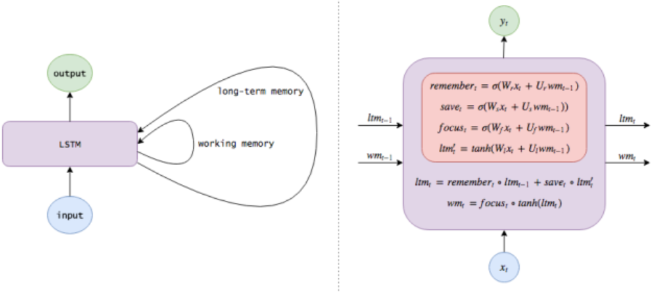

# 深度学习-43:长短时记忆神经网络(LSTM)

> [深度学习原理与实践(开源图书)-总目录](https://blog.csdn.net/shareviews/article/details/83040730)

长短时记忆神经网络(Long Short-term Memory Networks,LSTM)是一种 RNN 特殊的类型，可以学习长期依赖信息。LSTM 由 Hochreiter & Schmidhuber (1997) 提出，并在近期被 Alex Graves 进行了改良和推广。LSTM明确旨在避免长期依赖性问题。长时间记住信息实际上是他们的默认行为，而不是他们难以学习的东西！

## 1 LSTM网络的创新

- 循环神经网络(RNN)处理时间序列数据具有先天优势；
- 循环神经网络(RNN)通过反向传播和梯度下降算法达到了纠正错误的能力，但未解决梯度消失问题；
- 直到1997年，循环神经网络(RNN)引入了一个基于LSTM的架构后，梯度消失问题得以解决；
- LSTM的架构中的单元相当于一个模拟计算机，显著提高了网络精度。

## 2 LSTM网络的结构

由于循环神经网络(Recurrent NN)算法的弊端在于，随着时间的流逝，网络层数的增多，会产生梯度消失或梯度爆炸等问题。LSTM最早由 Hochreiter & Schmidhuber 在1997年提出，设计初衷是希望能够解决神经网络中的长期依赖问题。LSTM记忆单元具有遗忘门、输入门和输出门，LSTM记忆单元拥有长短时记忆机制。

### 2.1 时间序列数据

常见的时间序列数据包括:语言模型、手写体识别、序列生成、机器翻译、语音、视频分析等。时间序列数据的样本间存在顺序关系，每个样本和它之前的样本存在关联；直白一点呢的表述也就是选择和决策参考了上一次的状态。RNN不仅能够处理序列的输入，也能得到序列的输出，这里的序列指的是向量序列。

假设时间序列为: $X\{x_1, x_2, \ldots, x_N\}$

时间序列模型为:$P(X)=\prod_{i=1}^N{P(x_i|x_1,\ldots,x_{i-1})}$

根据输出和输入序列不同数量rnn可以有多种不同的结构，不同结构自然就有不同的引用场合。每个矩形是一个向量；箭头代表函数(例如矩阵乘法)；红色的是输入向量；蓝色的是输出向量；绿色的是某一时间的RNN状态。如下图，

- 函数问题(不是序列): 一个输入得到一个输出，未体现序列的特征，例如:图像分类场景。
- 一到多: 给一个输入得到一系列输出，可用于生产图片描述的场景，例如:图像自动字幕，将一幅幅图像转化为句子输出。
- 多到一: 给一系列输入得到一个输出，可用于文本情感分析，对一些列的文本输入进行分类，看是消极还是积极情感，例如:情感分类，将一个给定的句子分类为积极的情感或者负面的情感
- 间隔多到多: 给一些列输入得到一系列输出，可用于翻译或聊天对话场景，对输入的文本转换成另外的文本，例如:机器翻译，RNN读入英语的句子，翻译出法语的句子
- 同步多到多: 它是经典的rnn结构，前一输入的状态会带到下一个状态中，而且每个输入都会对应一个输出，例如:视频分类，我们需要给视频的每一帧打标签。


### 2.2 长期依赖问题

对于看电影、写作或思考的场景来说，我们总会或多或少的记住前面的东西(短暂记忆或持久记忆)，然后旧的记忆和新的记忆反复叠加，最终我们完成了电影、写作或思考之旅。例如，我们看章子怡的电影《无问西东》，我们可以根据已经发生的故事情节推测当前故事情节的可能情节；或者我们的大脑会把所有已经发生的故事串起来，在某一刹那我们的泪如雨下。

传统的神经网络(串行的卷积网络)不能做到这一点，这似乎是一个主要的缺点。例如，假设您想要对电影中每个点发生的事件进行分类。目前尚不清楚传统神经网络如何利用其对电影中先前事件的推理来告知后者。循环神经网络解决了这个问题。它们是具有循环的网络，允许信息持续存在。由于独特的设计结构，LSTM特别适合于处理时序间隔和延迟非常长的任务，作为非线性模型，LSTM非常适合于构造更大型深度神经网络。

#### 1 短期依赖问题

时序数据(文本、音频或视频等)任务中，多数情况需要很多的上下文联系(甚至常识知识)才能准确预测。考虑尝试预测文本中的最后一个词“我在法国长大......我说流利的法语。”。最近的信息表明，下一个词可能是一种语言的名称，但如果我们想缩小哪种语言，我们需要从更进一步的背景来看，法国的背景。相关信息与需要变得非常大的点之间的差距完全是可能的。不幸的是，随着差距的扩大，RNN无法学会连接信息。

</br>
图像来源:[colah blog](http://colah.github.io/)

#### 2 长期依赖问题

RNN的优势是能够将先前信息连接到当前任务。我们只需要查看最近的信息来执行当前任务。如果相关信息与所需地点之间的差距很小，RNN可以学习使用过去的信息。例如: 考虑一种语言模型，试图根据之前的单词预测下一个单词。如果我们试图预测“云在天空中”的最后一个词，我们不需要任何进一步的背景 - 很明显，下一个词将是天空。

</br>
图像来源:[colah blog](http://colah.github.io/)

### 2.3 模型的结构

递归神经网络(Recurrent NN)，它不仅能够完成简单地图像输入和事件输出行为，还能保持对世界的记忆（给不同信息分配的权重），以帮助改进自己的分类功能。循环神经网络(Recurrent NN)在很多自然语言处理项目中取得突破。循环神经网络(Recurrent NN)多采用反向传播时间(BPTT)算法。

</br>
图像来源:[colah blog](http://colah.github.io/)

由于循环神经网络(Recurrent NN)算法的弊端在于，随着时间的流逝，网络层数的增多，会产生梯度消失或梯度爆炸等问题。LSTM最早由 Hochreiter & Schmidhuber 在1997年提出，设计初衷是希望能够解决神经网络中的长期依赖问题。

#### 1 LSTM记忆单元

在检测完每个图像后，模型会输出一个标签，同时模型对世界的认识也会有所更新。

LSTM的重复网络模块的结构则复杂很多，它实现了三个门计算，即遗忘门、输入门和输出门。每个门负责是事情不一样，遗忘门负责决定保留多少上一时刻的单元状态到当前时刻的单元状态；输入门负责决定保留多少当前时刻的输入到当前时刻的单元状态；输出门负责决定当前时刻的单元状态有多少输出。

我们希望神经网络能学会如何更新自己的认识，这样神经网络就可以相对缓慢地更新它对世界的认识。添加遗忘机制。例如，如果某个场景结束了，模型就应该忘记当前场景的位置和时间，并且重置任何与该场景有关的信息；但是，如果某个人物在该场景中死亡了，那么模型应该继续记住该人物死亡的事实。因此，我们想要模型学习独立的的遗忘/记忆机制：当收到新的输入时，模型需要知道哪些认识应该保留以及哪些认识应该遗弃。

添加保存机制。当模型看到新的图像时，它需要学习关于该图像的所有信息是否值得使用以及是否值得保存。因此当收到新的输入信息时，模型首先忘记所有它认为自己不再需要的长期信息。然后，再学习新输入信息的哪部分具有使用价值，并且将它们保存到长期记忆中。将长期记忆聚焦为工作记忆。最后，模型需要学习哪一部分的长期记忆能立刻发挥作用。模型并不是始终都在使用全部的长期记忆的，它只需要学习应该集中注意力于哪部分记忆。

这就是长短期记忆网络。RNN在各个时间步中改写记忆的方式可以说是相当无序的，而LSTM改写自己记忆的方式是更加精确的：通过使用特定的学习机制来判断哪些信息需要记忆、哪些信息需要更新以及哪些信息需要特别注意。这有助于LSTM对信息进行长期跟踪。



- 长期记忆$ltm_t$通常被称为cell状态。
- 工作记忆$wm_t$通常被称为隐状态。它与普通RNN中的隐状态类似
- 记忆向量$remember_t$通常被称为记忆门(尽管记忆门中的1仍表示保留记忆，0仍表示忘记)
- 保存向量$save_t$通常被称为输入门(因为它决定输入信息中需要保存到cell状态中的程度)
- 关注向量$focus_t$通常被称为输出门

### 2.4 LSTM模型的训练

LSTM的参数训练算法，依然是我们熟悉的反向传播算法。对于这类反向传播算法，它们遵循的流程都是类似，简单说来，主要有如下三个步骤：

- 前向计算每个神经元的输出值。对于LSTM而言，依据前面介绍的流程，按部就班地分别计算出ft，it，ct，ot和st。
- 确定优化目标函数。在训练早期，输出值和预期值会不一致，于是可计算每个神经元的误差项值，借此构造出损失函数。
- 根据损失函数的梯度指引，更新网络权值参数。与传统RNN类似，LSTM误差项的反向传播包括两个层面：一个是空间上层面的，将误差项向网络的上一层传播。另一个是时间层面上的，沿时间反向传播，即从当前t时刻开始，计算每个时刻的误差。
- 然后跳转第（1）步，重新做（1）、（2）和（3）步，直至网络误差小于给定值。

## 3 LSTM网络的实现

这里我们简单地来看看在tensorflow中是如何实现使用RNN来完成具体的任务的。示例中，使用了著名的MNIST Data数据集，采用所构建的RNN来进行分类。

```python
import tensorflow as tf
from tensorflow.examples.tutorials.mnist import input_data
# set random seed for comparing the two result calculations
tf.set_random_seed(1)
mnist = input_data.read_data_sets('MNIST_data', one_hot=True)#从MNIST_data文件中读取数据

#设置超参数
lr = 0.001 #学习率
training_iters = 100000 #训练的迭代次数
batch_size = 128 #批尺寸

n_inputs = 28   # MNIST的输入数据是28*28的
n_steps = 28    #迭代次数
n_hidden_units = 128   # 隐藏层的神经元个数
n_classes = 10      # MNIST分类，0-9的是个数字

# tf图输入
x = tf.placeholder(tf.float32, [None, n_steps, n_inputs])
y = tf.placeholder(tf.float32, [None, n_classes])

# 权重的定义
weights = {
    'in': tf.Variable(tf.random_normal([n_inputs, n_hidden_units])), # (28, 128)输入
    'out': tf.Variable(tf.random_normal([n_hidden_units, n_classes]))# (128, 10)输出
}
biases = {#偏执
    'in': tf.Variable(tf.constant(0.1, shape=[n_hidden_units, ])),# (128, )
    'out': tf.Variable(tf.constant(0.1, shape=[n_classes, ]))# (10, )分10类
}


def RNN(X, weights, biases):
    X = tf.reshape(X, [-1, n_inputs])
    X_in = tf.matmul(X, weights['in']) + biases['in']
    X_in = tf.reshape(X_in, [-1, n_steps, n_hidden_units])
    if int((tf.__version__).split('.')[1]) < 12 and int((tf.__version__).split('.')[0]) < 1:
        lstm_cell = tf.nn.rnn_cell.BasicLSTMCell(n_hidden_units, forget_bias=1.0, state_is_tuple=True)
    else:
        lstm_cell = tf.contrib.rnn.BasicLSTMCell(n_hidden_units)
    init_state = lstm_cell.zero_state(batch_size, dtype=tf.float32)

    outputs, final_state = tf.nn.dynamic_rnn(lstm_cell, X_in, initial_state=init_state, time_major=False)

    if int((tf.__version__).split('.')[1]) < 12 and int((tf.__version__).split('.')[0]) < 1:
        outputs = tf.unpack(tf.transpose(outputs, [1, 0, 2]))    # states is the last outputs
    else:
        outputs = tf.unstack(tf.transpose(outputs, [1,0,2]))
    results = tf.matmul(outputs[-1], weights['out']) + biases['out']    # shape = (128, 10)

    return results


pred = RNN(x, weights, biases)
cost = tf.reduce_mean(tf.nn.softmax_cross_entropy_with_logits(logits=pred, labels=y))
train_op = tf.train.AdamOptimizer(lr).minimize(cost)

correct_pred = tf.equal(tf.argmax(pred, 1), tf.argmax(y, 1))
accuracy = tf.reduce_mean(tf.cast(correct_pred, tf.float32))

with tf.Session() as sess:
    if int((tf.__version__).split('.')[1]) < 12 and int((tf.__version__).split('.')[0]) < 1:
        init = tf.initialize_all_variables()#解决老版本的兼容性问题
    else:
        init = tf.global_variables_initializer()#tensorflow版本 >= 0.12的情况
    sess.run(init)#初始化
    step = 0
    while step * batch_size < training_iters:#小于所设置的迭代次数的时候
        batch_xs, batch_ys = mnist.train.next_batch(batch_size)
        batch_xs = batch_xs.reshape([batch_size, n_steps, n_inputs])
        sess.run([train_op], feed_dict={
            x: batch_xs,
            y: batch_ys,
        })
        if step % 20 == 0:
            print(sess.run(accuracy, feed_dict={
            x: batch_xs,
            y: batch_ys,
        }))
        step += 1
```

## 4 LSTM网络的演进

- 1997年, Hochreiter & Schmidhuber提出的Long Short-Term Memory(LSTM)
- 2009年, 用改进版LSTM赢得ICDAR手写识别比赛冠军。
- 2014年, Bengio团队提出了一种更加好用的LSTM变体GRU (Gated Recurrent Unit，门控环单元)
- 2016年, 谷歌公司利用LSTM来做语音识别和文字翻译。
- 2016年, 苹果公司使用LSTM来优化Siri应用。

## 系列文章

- [深度学习原理与实践(开源图书)-总目录](https://blog.csdn.net/shareviews/article/details/83040730)
- [机器学习原理与实践(开源图书)-总目录](https://blog.csdn.net/shareviews/article/details/83030331)
- [Github: 机器学习&深度学习理论与实践(开源图书)](https://github.com/media-tm/MTOpenML)

## 参考文献

- [1] Ian Goodfellow, Yoshua Bengio. [Deep Learning](http://www.deeplearningbook.org/). MIT Press. 2016.
- [2] 焦李成等. 深度学习、优化与识别. 清华大学出版社. 2017.
- [3] 佩德罗·多明戈斯. 终极算法-机器学习和人工智能如何重塑世界. 中信出版社. 2018.
- [4] 雷.库兹韦尔. 人工智能的未来-揭示人类思维的奥秘.  浙江人民出版社. 2016.
- [5] [了解LSTM网络](http://colah.github.io/posts/2015-08-Understanding-LSTMs/)