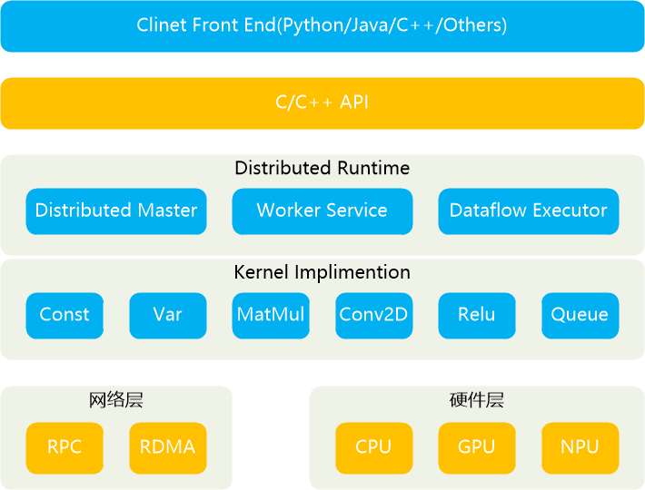
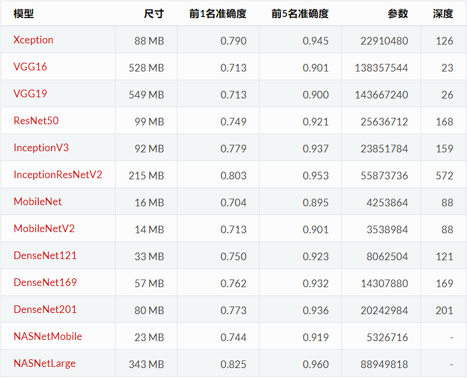

# 深度学习-71: Tensorflow的架构、模型、可视化和案例库

> [深度学习原理与实践(开源图书)-总目录](https://blog.csdn.net/shareviews/article/details/83040730),建议收藏，告别碎片阅读!

文本介绍Tensorflow的架构，Tensorflow内置数据集，Tensorflow内置模型、内置可视化支持和相关在线资源。Tensorflow一个高度模块化的神经网络库，支持GPU和CPU。TensorFlow是一个使用数据流图进行数值计算的开源软件库。TensorFlow最初是由研究人员和工程师在Google机器智能研究组织的Google Brain团队开发的，目的是进行机器学习和深度神经网络研究。 该系统通用性足以适用于各种其他领域。

## 1 Tensorflow的架构

TensorFlow最初是由研究人员和工程师在Google机器智能研究组织的Google Brain团队开发的，目的是进行机器学习和深度神经网络研究。 该系统通用性足以适用于各种其他领域。

TensorFlow是一个使用数据流图进行数值计算的开源软件库。 图形节点表示数学运算，而图形边缘表示在它们之间流动的多维数据阵列(张量)。 这种灵活的体系结构使您可以将计算部署到桌面，服务器或移动设备中的一个或多个CPU或GPU，而无需重写代码。 TensorFlow还包括TensorBoard，一种数据可视化工具包。

Tensoerflow支持的高级特性：

- 高度的灵活性:通过构件计算图能实现任意目的的计算
- 高可移植性(Portability):Tensorflow 在CPU和GPU上运行，比如说可以运行在台式机、服务器、手机移动设备等等。
- 将科研和产品联系在一起
- 自动求微分:基于梯度的机器学习算法会受益于Tensorflow自动求微分的能力。
- 多语言支持:Tensorflow 有一个合理的c++使用界面，也有一个易用的python使用界面来构建和执行你的graphs。
- 性能最优化:由于Tensorflow 给予了线程、队列、异步操作等以最佳的支持，能发挥硬件全部潜能。 

Tensorflow的原理和架构，见下图。



## 2 Tensorflow的数据集

### 2.1 波斯顿房价回归数据集

- 数据集取自卡内基梅隆大学维护的StatLib库。

```python
from tensorflow.python import keras
(x_train, y_train), (x_test, y_test) = keras.datasets.boston_housing.load_data()
```

### 2.2 IMDB电影影评情感分类

- 训练集：25000条评论，正面评价标为1，负面评价标为0
- 测试集：25000条评论

```python
from tensorflow.python import keras
(x_train, y_train), (x_test, y_test) = keras.datasets.imdb.load_data(path="imdb.npz",
```

### 2.3 路透社新闻专线主题分类

总数据集：11228条新闻专线，46个主题。

```python
from tensorflow.python import keras
(x_train, y_train), (x_test, y_test) = keras.datasets.reuters.load_data(path="reuters.npz", ....)
```

### 2.4 手写数字MNIST数据集

- 训练集：60000张灰色图像，大小28*28，共10类（0-9）
- 测试集：10000张灰色图像，大小28*28

```python
from tensorflow.python import keras
(x_train, y_train), (x_test, y_test) = keras.datasets.mnist.load_data()
```

### 2.5 时尚MNIST数据库(鞋服裙帽)

- MNIST已经被玩坏了！用时尚MNIST替换吧!
- 训练集：60000张灰色图像，大小28*28，共10类（0-9）
- 测试集：10000张灰色图像，大小28*28

```python
from tensorflow.python import keras
(x_train, y_train), (x_test, y_test) = keras.datasets.mnist.load_data()
```

### 2.6 CIFAR10小图像

- 训练集：50000张彩色图像，大小32*32，被分成10类
- 测试集：10000张彩色图像，大小32*32

```python
from tensorflow.python import keras
(x_train, y_train), (x_test, y_test) = keras.datasets.cifar10.load_data()
```

### 2.7 CIFAR100小图像

- 训练集：50000张彩色图像，大小32*32，被分成100类
- 测试集：10000张彩色图像，大小32*32

```python
from tensorflow.python import keras
(x_train, y_train), (x_test, y_test) = keras.datasets.cifar100.load_data()
```

## 3 Tensorflow的内置模型

[TensorFlow Model Zoo](https://github.com/tensorflow/models)

- 官方模型是使用TensorFlow的高级API的示例模型的集合。 它们旨在通过最新的稳定TensorFlow API进行良好维护，测试并保持最新。 它们还应进行合理优化，以便在保持易读性的同时实现快速性能。 我们特别推荐新的TensorFlow用户从这里开始。

- 研究模型是研究人员在TensorFlow中实施的大量模型。 它们没有得到官方支持或在发布分支中可用; 由个体研究人员来维护模型和/或提供问题和拉取请求的支持。

Tensorflow支持Keras的API。Keras提供了预训练的深度学习模型，这些模型可用于预测，特征提取和微调。Keras接口的模型使用方法，请参考文档[Keras Application](https://keras.io/applications/)。

使用[Keras Applications](https://github.com/keras-team/keras-applications)和2012年ILSVRC ImageNet验证集上的TensorFlow后端获得top-k错误，可能与原始版本略有不同。除NASNetLarge（331x331），InceptionV3（299x299），InceptionResNetV2（299x299）和Xception（299x299）外，所有型号的输入大小均为224x224。

使用ImageNet训练的权重进行图像分类的Keras模型：

- Xception
- VGG16
- VGG19
- ResNet50
- InceptionV3
- InceptionResNetV2
- MobileNet
- DenseNet
- NASNet
- MobileNetV2

</br>
数据说明: Top-1和Top-5准确度是指模型在ImageNet验证数据集上的性能。</br>
数据来源：keras-team/keras-applications

## 4 TensorFlow的可视化支持

你将使用TensorFlow进行的计算 - 比如训练一个庞大的深度神经网络 - 可能是复杂和令人困惑的。为了更容易理解，调试和优化TensorFlow程序，我们提供了一套名为TensorBoard的可视化工具。您可以使用TensorBoard可视化您的TensorFlow图，绘制有关图表执行的量化指标，并显示其他数据，如通过它的图像。

使用TensorBoard的第一步从TensorFlow运行中获取数据,获取数据的操作成为摘要操作或汇总操作。摘要操作包含2个步骤: 它们生成的Tensors包含序列化的protobufs，它们写入磁盘并发送到TensorBoard。TensorBoard支持的摘要操作包括：

- tf.summary.scalar
- tf.summary.image
- tf.summary.audio
- tf.summary.text
- tf.summary.histogram

关于模型可视化的在线案例:

- [Feature Visualization: How NN build up their understanding of images](https://distill.pub/2017/feature-visualization/)
- [Deconvolution and Checkerboard Artifacts](https://distill.pub/2016/deconv-checkerboard/)
- [The Building Blocks of Interpretability](https://distill.pub/2018/building-blocks/)

## 5 在线案例、课程

- [TensorFlow Tutorials](https://www.tensorflow.org/tutorials/)
- [TensorFlow Model Zoo](https://github.com/tensorflow/models)
- [TensorFlow Course at Stanford](https://web.stanford.edu/class/cs20si/)
- [TensorFlow White Papers](https://www.tensorflow.org/about/bib)

## 系列文章

- [深度学习原理与实践(开源图书)-总目录](https://blog.csdn.net/shareviews/article/details/83040730)
- [机器学习原理与实践(开源图书)-总目录](https://blog.csdn.net/shareviews/article/details/83030331)
- [Github: 机器学习&深度学习理论与实践(开源图书)](https://github.com/media-tm/MTOpenML)

## 参考文献

- [1] Ian Goodfellow, Yoshua Bengio. [Deep Learning](http://www.deeplearningbook.org/). MIT Press. 2016.
- [2] 焦李成等. 深度学习、优化与识别. 清华大学出版社. 2017.
- [3] 佩德罗·多明戈斯. 终极算法-机器学习和人工智能如何重塑世界. 中信出版社. 2018.
- [tensorflow/tensorflow](https://github.com/tensorflow/tensorflow)
- [tensorflow/models](https://github.com/tensorflow/models)