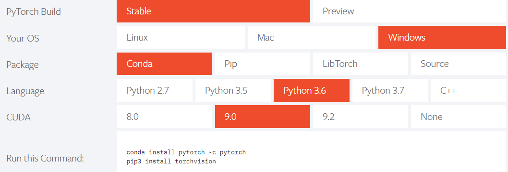

# 深度学习-72: PyTorch的架构、模型、可视化和案例库

> [深度学习原理与实践(开源图书)-总目录](https://blog.csdn.net/shareviews/article/details/83040730)，建议收藏，告别碎片阅读!

文本介绍PyTorch的架构，PyTorch内置数据集，PyTorch内置模型、PyTorch的可视化支持和相关在线资源。PyTorch(Caffe2)通过混合前端，分布式训练以及工具和库生态系统实现快速，灵活的实验和高效生产。PyTorch 和 TensorFlow 具有不同计算图实现形式，TensorFlow 采用静态图机制(预定义后再使用)，PyTorch采用动态图机制(运行时动态定义)。

## 1 PyTorch的架构

[PyTorch(Caffe2)](https://pytorch.org) 通过混合前端，分布式训练以及工具和库生态系统实现快速，灵活的实验和高效生产。PyTorch 和 TensorFlow 具有不同计算图实现形式，TensorFlow 采用静态图机制(预定义后再使用)，PyTorch采用动态图机制(运行时动态定义)。PyTorch具有以下高级特征：

- 混合前端:新的混合前端在急切模式下提供易用性和灵活性，同时无缝转换到图形模式，以便在C ++运行时环境中实现速度，优化和功能。
- 分布式训练:通过利用本地支持集合操作的异步执行和可从Python和C ++访问的对等通信，优化了性能。
- Python优先: PyTorch为了深入集成到Python中而构建的，因此它可以与流行的库和Cython和Numba等软件包一起使用。
- 丰富的工具和库:活跃的研究人员和开发人员社区建立了丰富的工具和库生态系统，用于扩展PyTorch并支持从计算机视觉到强化学习等领域的开发。
- 本机ONNX支持:以标准ONNX（开放式神经网络交换）格式导出模型，以便直接访问与ONNX兼容的平台，运行时，可视化工具等。
- C++前端：C++前端是PyTorch的纯C++接口，它遵循已建立的Python前端的设计和体系结构。它旨在实现高性能，低延迟和裸机C++应用程序的研究。
- 使用GPU和CPU优化的深度学习张量库。

</br>
图-X PyTorch支持多平台(GPU/GPU/OS)

## 2 Torch内置数据集

Torch的内置数据集都是torch.utils.data.Dataset的子类，即它们实现了__getitem__和__len__方法。 因此，它们都可以传递给torch.utils.data.DataLoader，它可以使用torch.multiprocessing worker并行加载多个样本。

Torch的内置数据集非常丰富，[torchvision.datasets](https://pytorch.org/docs/stable/torchvision/datasets.html)。

```python
class torchvision.datasets.MNIST(root, train=True, transform=None, target_transform=None, download=False)
class torchvision.datasets.FashionMNIST(root, train=True, transform=None, target_transform=None, download=False)
class torchvision.datasets.EMNIST(root, split, **kwargs)
class torchvision.datasets.CocoCaptions(root, annFile, transform=None, target_transform=None)
class torchvision.datasets.CocoDetection(root, annFile, transform=None, target_transform=None)
class torchvision.datasets.LSUN(root, classes='train', transform=None, target_transform=None)
class torchvision.datasets.ImageFolder(root, transform=None, target_transform=None, loader=)
class torchvision.datasets.DatasetFolder(root, loader, extensions, transform=None, target_transform=None)
class torchvision.datasets.CIFAR10(root, train=True, transform=None, target_transform=None, download=False)
class torchvision.datasets.CIFAR100(root, train=True, transform=None, target_transform=None, download=False)
class torchvision.datasets.STL10(root, split='train', transform=None, target_transform=None, download=False)
class torchvision.datasets.SVHN(root, split='train', transform=None, target_transform=None, download=False)
class torchvision.datasets.PhotoTour(root, name, train=True, transform=None, download=False)
```

## 3 Torch内置模型

[torchvision.models](https://pytorch.org/docs/stable/torchvision/models.html)模型包含以下模型体系结构的定义：

- AlexNet
- VGG
- ResNet
- SqueezeNet
- DenseNet
- Inception v3

PyTorch引擎的torchvision.models提供了很多知名的模型，并且提供了预先训练的版本。通过传递pretrained = True来构造预先训练的模型版本。

```python
import torchvision.models as models
resnet18 = models.resnet18(pretrained=True)
alexnet = models.alexnet(pretrained=True)
squeezenet = models.squeezenet1_0(pretrained=True)
vgg16 = models.vgg16(pretrained=True)
densenet = models.densenet161(pretrained=True)
inception = models.inception_v3(pretrained=True)
```

也可以使用torch.utils.model_zoo加载在线存储的网络模型

```python
state_dict = torch.utils.model_zoo.load_url('https://s3.amazonaws.com/pytorch/models/resnet18-5c106cde.pth')
```

## 4 PyTorch的可视化支持

[facebookresearch/visdom 项目](https://github.com/facebookresearch/visdom)提供了一种灵活的工具，用于创建，组织和共享实时丰富数据的可视化。Visdom旨在促进（远程）数据的可视化，重点是支持科学实验。

## 5 在线案例、课程

- [yunjey/pytorch-tutorial](https://github.com/yunjey/pytorch-tutorial)
- [chenyuntc/pytorch-book](https://github.com/chenyuntc/pytorch-book)
- [spro/practical-pytorch](https://github.com/spro/practical-pytorch)

## 系列文章

- [深度学习原理与实践(开源图书)-总目录](https://blog.csdn.net/shareviews/article/details/83040730)
- [机器学习原理与实践(开源图书)-总目录](https://blog.csdn.net/shareviews/article/details/83030331)
- [Github: 机器学习&深度学习理论与实践(开源图书)](https://github.com/media-tm/MTOpenML)

## 参考文献

- [1] Ian Goodfellow, Yoshua Bengio. [Deep Learning](http://www.deeplearningbook.org/). MIT Press. 2016.
- [2] 焦李成等. 深度学习、优化与识别. 清华大学出版社. 2017.
- [3] 佩德罗·多明戈斯. 终极算法-机器学习和人工智能如何重塑世界. 中信出版社. 2018.
- [PyTorch documentation](https://pytorch.org/docs)
- [Visualize Convolutional Neural Network](https://tangzhenyu.github.io/deep_learning/2015/03/02/visulize-cnn.html)