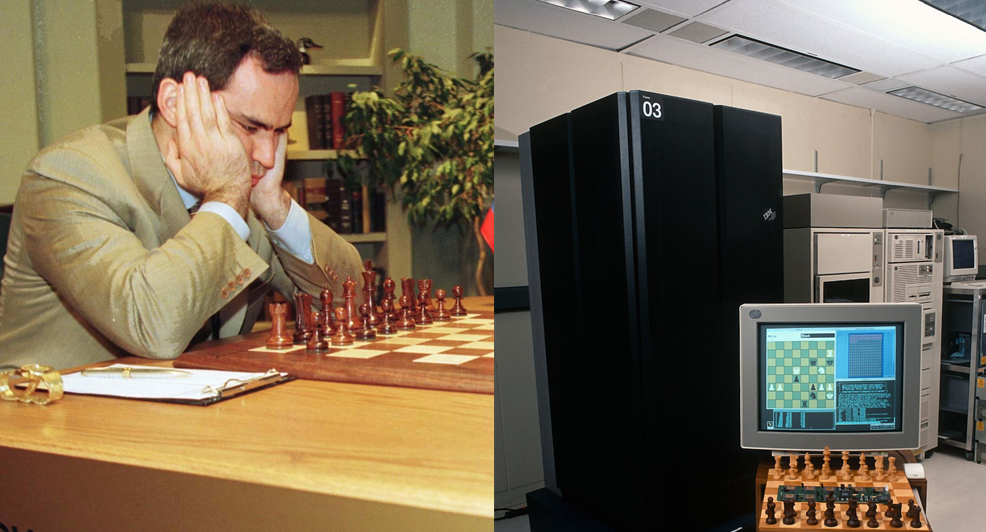
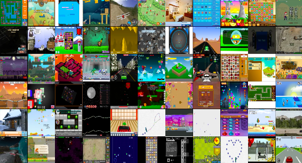

# 深度学习-81:游戏中的人工智能

> [CSDN专栏: 机器学习&深度学习(理论/实践)](https://blog.csdn.net/column/details/27839.html)

人工智能模块一直是游戏设计的核心，人工智能模块能够能够让软件游戏更加灵动而让用户无比兴奋。最早的让人工智能的深度优先和广度优先算法融入游戏就一发不可收拾，各种游戏模块均被智能化改造，让软件游戏具有了弱智能的特性。伴随着深度学习技术的成熟，游戏世界又一次迎来了人工智能应用的高潮。

## 1 人工智能游戏大事记

### 1.1 深蓝问鼎国际象棋

计算机科学家尤其是人工智能科学家把国际象棋作为AI进步的标杆。通过人脑和超级电脑的智慧碰撞，使人工智能以颠覆性的方式进入科技的各个领域。1989年，卡内基梅隆大学的研究团队开发出了第一台象棋计算机“深思(Deep Thought)”,在当年和顶级选手卡斯帕罗夫(Kasparov)的对弈中，深思象棋计算机表现平平； IBM公司资助卡内基梅隆大学的研究团队开发出初代“深蓝”计算机，1996年2月和顶级选手卡斯帕罗夫(Kasparov)的对弈中，深蓝象棋计算机依旧表现平平； 1997年5月和顶级选手卡斯帕罗夫(Kasparov)的对弈中，“深蓝”计算机成为历史上第一个成功在标准国际象棋比赛中打败卫冕世界冠军的计算机系统。

 
图-X: 深蓝和卡斯帕罗夫的围棋对弈(DeepBlue vs Garry Kasparov)

“深蓝”计算机的优势:

- 使用混合架构，超级计算机处理器与象棋加速器芯片相结合，每秒可运算2亿步的算力，全球超算排名第259位
- “深蓝”计算机具有宏大的象棋数据库，广义的评估策略，至少能提前预测6-8步
- 不排除拥有人工干预模式

### 1.2 深弗里茨再战国际象棋

2002年10月9日，在巴林麦纳麦举行国际象棋人机对抗赛， 棋王克拉姆尼克对战电脑深弗里茨。在前四局较量中，克拉姆尼克显得游刃有余，两胜两和，大有将他的电脑对手“玩弄于股掌间”的气势，似乎在这场人脑和电脑的较量中人类将轻松取胜，从而一雪前耻。后四局中，德国科学家团队即时优化了电脑深弗里茨的代码和策略，最终俄罗斯棋王克拉姆尼克与电脑棋手“更弗里茨”最终4-4打平。

2006年11月29日，在德国波恩举行的国际象棋世界冠军赛， 克拉姆尼克与顶尖计算机程序深弗里茨(Deep Fritz)的人机大战。俄罗斯棋王克拉姆尼克错失大好局面最终铩羽而归。国际象棋是人类智慧的高地，也是欧美人工智能的试金石，从此人类再也无法轻视人工智能了。

### 1.3 AlphaGo的围棋逆袭

围棋是人类最后的智力竞技高地。据估算，围棋的可能下法数量超越了可观测宇宙范围内的原子总数，显然，“深蓝”式的硬算在围棋上行不通。对于围棋，AI长期以来举步维艰，顶级AI甚至不能打败稍强的业余选手。但人工智能AlphaGo背后的科学家利用神经网络算法，将棋类专家的比赛记录输入给计算机，并让计算机自己与自己进行比赛，在这个过程中不断学习训练。某种程度上讲，AlphaGo的棋艺不是开发者教给他的，而是自学成才。

2016年1月，美国谷歌公司旗下的人工智能公司“深度思维”在《自然》杂志上报告说，该公司研发的“阿尔法狗”人工智能程序2015年10月以5比0战胜欧洲围棋冠军樊麾，这是人工智能程序首次在不让子的情况下战胜人类围棋选手。
2016年03月09日至15日，谷歌计算机围棋程序“阿尔法围棋”（AlphaGo）与韩国棋手李世石进行5场交战，李世石首场战败。

 
图-X: AlphaGo和李世石的围棋对弈(AlphaGo vs Lee Sedol)

## 2 人工智能是游戏王者吗？

当然棋类游戏是智力游戏的一种，以上成就只是单一任务的，单一人工智能程序能够掌握所有游戏类型吗？ 自学习，自进化，自称王吗？ 现实世界中，存在多种游戏：棋类游戏、竞速游戏、问答游戏、射击游戏、街机游戏、即时战略游戏和开放世界游戏等。

通用游戏人工智能面临系列开放挑战，道阻且长。人工智能很多理论可以应用在通用游戏人工智能，目前还没有系统理论，但是星星之火可以燎原。目前深度学习打开潘多拉魔盒后，人工智能工具箱逐渐丰富起来，很多机构均将第一目标设定为： 通用人工智能。当前人工智能工具箱具有：

- 监督学习： 在神经网络中，数据正向传播，误差反向传播，逐渐优化网络保证通用性和低误差。游戏适用于循环神经网络(RNN);
- 无监督学习：无监督学习的目标不是学习数据和标签之间的映射，而是在数据中发现模式。这些算法可以学习数据集的特征分布，用于集中相似的数据、将数据压缩成必要特征，或者创建具备原始数据特征的新的合成数据。游戏适用于自编码网络(玻尔兹曼机);
- 强化学习: 在用于游戏的强化学习中，智能体通过与环境互动来学习打游戏。游戏适用于生成式对抗网络;
- 混合方法：将深度学习方法和其他机器学习方法结合起来。深度学习方法能够直接从高维原始像素值中学习，进化方法不需要依赖可微分架构，且在稀疏奖励的游戏中表现良好。

## 3 挑战通用游戏人工智能

2016年4月，腾讯副总裁姚星牵头成立了腾讯人工智能实验室(AI Lab)，战略定位是: 打造通用人工智能、打造虚拟世界到现实世界的连接体和聚焦医疗。姚星认为: AI研究的下一个难题是通用人工智能。游戏又是通向通用人工智能最佳的场景，游戏本身的目的就是通过虚拟世界仿真现实世界。可以看到，世界上最好的几个研究组织都用游戏虚拟世界去仿真整个现实世界。

目前人工智能中的图像识别、语音识别和自然语言处理等都有它的局限性，普遍表现在对已知数据库数据过拟合，通用性差。尤其是自然语言处理，一句话稍微改变一下就无法识别，它并非那么智能，它更多的是特定模式下的识别。这些针对具体领域的AI模型，属于专用智能，可以在特定领域实现超人的表现，但缺乏在该领域外合理执行任务的能力。通用人工智能道阻且长，希望通用游戏人工智能是通往通用人工智能的钥匙。

具有一般问题解决能力的系统，类似于拥有人类常识，让智能体能够快速解决新的困难任务。现在的智能体还不能将其经验携带到新的任务中。在标准训练制度下，智能体从零开始初始化，随机抽取数千万试验中的一个，经过不断试错、学会重复行为，最终得到有益的结果。如果要向通用AI智能体取得进展，我们必须让智能体经历一系列不同的任务，以便它们能够发展出关于世界的知识和解决问题的策略，以便在新任务中有效地重复使用这些东西。

2016 年的最后一个月，OpenAI 在 NIPS 2016 来临之际发布 Universe。Universe是一个能在世界上所有的游戏、网站和其他应用中，衡量和训练AI通用智能的软件平台。Universe要让AI智能体能像人一样使用计算机：通过看显示屏，操作虚拟键盘和鼠标。我们必须全方位地训练AI系统，解决我们想要它们解决的问题，而Universe则让我们能够训练单一的智能体，执行任何人类能使用计算机来完成的任务。

 
图-X: Universe游戏环境中的游戏样本

## 系列文章

- [CSDN专栏: 机器学习&深度学习(理论/实践)](https://blog.csdn.net/column/details/27839.html)
- [Gihutb专栏: 机器学习&深度学习(理论/实践)](https://github.com/media-tm/MTOpenML)

## 参考文献

- [1] Ian Goodfellow, Yoshua Bengio. [Deep Learning](http://www.deeplearningbook.org/). MIT Press. 2016.
- [2] 焦李成等. 深度学习、优化与识别. 清华大学出版社. 2017.
- [3] 佩德罗·多明戈斯. 终极算法-机器学习和人工智能如何重塑世界. 中信出版社. 2018.
- [4] 雷.库兹韦尔. 人工智能的未来-揭示人类思维的奥秘.  浙江人民出版社. 2016.
- [5] [OpenAI/Universe Blog](https://blog.openai.com/universe/)