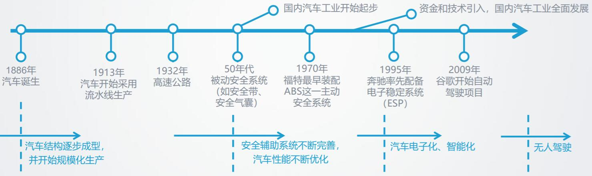
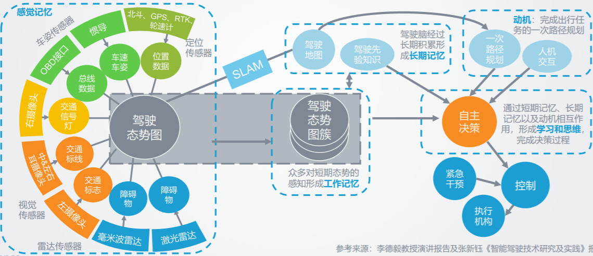
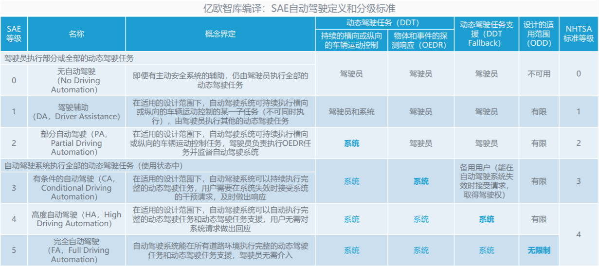
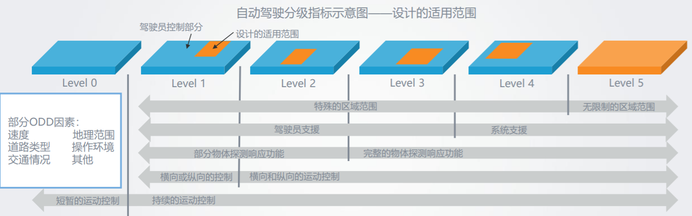

# 深度学习-84:自动驾驶技术(L0-L5级别)

> [CSDN专栏: 机器学习&深度学习(理论/实践)](https://blog.csdn.net/column/details/27839.html)

人工智能在驾驶领域的应用最为深入。通过依靠人工智能、视觉计算、雷达、监控装置和全球定位系统协同合作，让电脑可以在无人类主动的操作下，自动安全进行操作。自动驾驶系统主要由环境感知、决策协同、控制执行组成。

目前自动驾驶在人工智能的应用领域中主要应用场景包括智能汽车、公共交通、快递用车、工业应用等。目前领先的企业主要有谷歌、特斯拉、百度、Uber、奔驰、京东、亚马孙等。

## 1 汽车工业的演进和进化

- 在1886年，汽车诞生以来。
- 在1913年，汽车开始采用流水线生产。汽车工业已经逐步实现了平民化，使汽车作为交通工具真正被普及。
- 在1932年，高速公路诞生。
- 在1950年，被动安全系统(如安全带、安全气囊)。汽车普及过程中，被动式与主动式的安全系统逐步配套。
- 在1970年，福特开始使用ABS主动安全系统。汽车普及过程中，被动式与主动式的安全系统逐步配套。
- 在1995年，奔驰率先配备电子稳定系统(ESP)。汽车普及过程中，被动式与主动式的安全系统逐步配套。
- 在2009年，谷歌开始自动驾驶项目。
- 进入21世纪，汽车逐步向智能化、轻量化、电动化、网联化、出行方式共享化等方向发展；自动驾驶作为重要的发展趋势之一，将再次彻底改变出行方式。
- 我国汽车工业起步较晚，但在新能源汽车等领域进展较快，并率先赶上自动驾驶研发热潮，有望在汽车产业发挥引领作用。

数据来源: 亿欧智库[2]

## 2 自动驾驶技术的挑战

类似于人脑的运作，自动驾驶汽车的传感器感知到的数据会每隔一段时间形成驾驶态势图簇，构成车辆的工作记忆；长期记忆包含了驾驶地图以及各类驾驶先验知识；动机则是智能驾驶的某个路径要求，可通过人机交互传达给车辆。通过短期记忆、长期记忆以及动机相互作用，车辆形成了自主决策，传递控制指令给执行机构，完成整个自动驾驶的过程。自动驾驶的技术体系如下，如下图。

数据来源: 亿欧智库[2]

数据、共享经济和人工智能技术正在打破过去成熟的金字塔式的汽车产业链结构。不同环节的企业相互合作，以实现最佳的经济效益为目标，使得数据、技术、资本得以在整个自动驾驶产业生态之中流动、循环。当然，目前这一生态结构尚处于不稳定的发展变化状态中。自动驾驶技术的生态系统，如下图。

数据来源: 亿欧智库[2]

### 2.1 高精度传感器

目前自动驾驶汽车使用的高精度传感器还没有标准化，处于百家争鸣的状态。正是因为传感器感知缺陷这种客观因素的存在，整车厂做自动驾驶时就显得尤为保守，要么增加传感器以加强感知能力，比如全新奥迪A8加的四线激光雷达；要么就通过监视驾驶员的面部状态，确保驾驶员实时观测着前方路况，比如凯迪拉克CT6。

### 2.2 AI智能软硬件

目前自动驾驶汽车还没有通用的硬件和通用的操作系统。虽然顶级芯片公司和互联网公司有这方面的野心。自动驾驶软件服务，是面向汽车企业提供包括感知、自定位和决策在内的应用级自动驾驶辅助软件服务。L3级HMI人机交互产品是基于百度地图的基础架构和数据采集能力，充分利用地图、导航、私有云、语音、安全 等产品的优势，为车主搭建的更为完善的人车互联服务平台。为了更好的用户体验，目前已有四种解决方案。

### 2.3 通信

自动驾驶汽车会产生海量的传感器数据，多媒体数据和控制数据等，这些海量数据部分通过自动驾驶汽车自身的硬件系统就可以处理完毕。但是也有相当的数据需要上传到云服务器做进一步处理，云服务器处理的结果在反馈给自动驾驶汽车。对于实时控制系统，中低的网络延时都会造成难以预测的结果。目前的3G/4G无线通信网络还无法承载这么巨量的数据并保持超低的网络时延。

### 1.4 大数据处理

百度汽车大数据是一款基于百度智能汽车生态的大数据服务产品。结合百度数据及车企数据，完成人、车、路的联动分析， 为车企提供精准营销，整车设计，用户管理，舆情分析等多方面的数据和服务支持，拉近车企与车主距离，最大化车企价值和利益。

### 2.4 立法问题

- 加入高等级自动驾驶汽车，出了交通事故，是车主负责，保险公司负责，汽车商负责还是政府负责？
- 人类主动破坏高等级自动驾驶系统，造成故意交通事故，责任如何认定？
- 移动通信网络不稳定，导致自动驾驶系统相应时间变长，造成故意交通事故，责任如何认定？

## 3 自动驾驶分级标准

目前被国内外广为接受的是SAE分级(www.sae.org)，从Level-0~Level-5总计6个级别,Level-0为最低级别，Level-5为最高级别。汽车自动驾驶技术包括视频摄像头、雷达传感器以及激光测距器来了解周围的交通状况，并通过一个详尽的地图(通过有人驾驶汽车采集的地图)对前方的道路进行导航。沃尔沃根据自动化水平的高低区分了四个无人驾驶的阶段：驾驶辅助、部分自动化、高度自动化、完全自动化:

### 3.1 SAE自动驾驶分级标准

SAE(国际汽车工程学会)的J3016文件提出的五级自动驾驶分级方案是当前被普遍采用接受的标准。SAE J3016(TM)提供了一种五级自动驾驶分级方案，描述了在公路行驶的各种驾驶自动化水平车辆，包括高级驾驶自动化及相关术语和定义的功能定义。这个推荐标准由AdaptIVe Consortium和Crash Avoidance在欧洲和美国开展的研究项目
Metrics Partnership(CAMP)自动车辆研究(AVR)联盟的技术积累和经验教训总结而成，为推动自动化规范和技术要求提供有用的框架。SAE自动驾驶定义和分级标准-v2016，如下图。

数据来源: 亿欧智库[2]

- 无自动驾驶(Level-0)
SAE定义： 由人类驾驶者全时操作汽车，在行驶过程中可以得到警告和保护系统的辅助。目前没有辅助驾驶的车辆，认为是Level-0，Level-0车辆可能包含一些主动安全装置。

- 驾驶支援(Level-1)
SAE定义： 通过驾驶环境信息对方向盘和加减速中的一项操作提供驾驶支援，其他的驾驶操作由人类驾驶者完成。目前辅助驾驶技术如车道保持、定速巡航、ACC自适应巡航和ESP等，中高级轿车这已经是标配了，但是辅助驾驶技术总体舒适性还存在差异。

- 部分自动化(Level-2)
SAE定义： 通过驾驶环境信息对方向盘和加减速中的多项操作提供驾驶支援，其他的驾驶操作由人类驾驶者完成。Level2的系统仅能处理少数高频通用驾驶场景，超出能力自动驾驶系统将控制权交给人类驾驶员，人类驾驶员需要实时监控并做好接管车辆的准备。Level-2和Level-1最明显的区别是系统能否同时在车辆横向和纵向上进行控制。

- 有条件自动化(Level-3)
SAE定义： 通过驾驶环境信息对方向盘和加减速中的多项操作提供驾驶支援，其他的驾驶操作由人类驾驶者完成。有条件自动驾驶是指在某些特定场景下(高速公路/道路拥塞等)进行自动驾驶，人类驾驶员还是需要监控驾驶活动。Level-3现在是2018-2020的研发重点。

- 高度自动化(Level-4)
SAE定义： 由无人驾驶系统完成全时驾驶操作，根据系统请求，人类驾驶者不一定需要对所有的系统请求做出应答，限定道路和环境条件。Level-3还未成熟，相关车型极少；Level-4预计2020-2023将成为研发重点。。Level-4的自动驾驶算法准确性和精确性需要达到，甚至超过人类的认知水平，这就需要的是极具鲁棒性的算法和稳定的计算平台。目前自动驾驶使用的高精度传感器(激光雷达等)和自动驾驶控制芯片价格极其昂贵，离普及还有相当的距离。

- 部分自动化(Level-5)
可无人驾驶车辆、允许车内所有乘员从事其他活动且无需进行监控的系统。这种自动化水平允许乘从事计算机工作、休息和睡眠以及其他娱乐等活动。Level-4/Level-5逐渐普及之后，百年的汽车行业，将发生重大变革，我们的出行模式也将巨变。

### 3.2 SAE标准的指标解读

数据来源: 亿欧智库[2]

- DDT（Dynamic Driving Task，动态驾驶任务）：指在道路上驾驶车辆需要做的实时操作和决策行为，操作包括转向、加速和减速，决策包括路径规划等。
- DDT Fallback（动态驾驶任务支援）：自动驾驶在设计时，需考虑发生系统失效或者出现超出系统设计的使用范围之外的情况，当该情形发生时，驾驶员或自动驾驶系统需做出最小化风险的解决响应。
- OEDR（Object and Event Detection and Response，物体和事件的探测和响应）：指驾驶员或自动驾驶系统对突发情况的探测和应对，在自动驾驶模式下，系统负责OEDR，应对可能影响安全操作的其他事物，进行检测响应。
- ODD（Operational Design Domain，设计的适用范围）：将已知的天气环境、道路情况、车速、车流量等信息作出测定，给定自动驾驶系统具体的条件，以确保系统能力在安全适用的环境之内。

## 系列文章

- [CSDN专栏: 机器学习理论与实践(开源图书)](https://blog.csdn.net/column/details/27839.html)
- [CSDN专栏: 深度学习理论与实践(开源图书)](https://blog.csdn.net/column/details/27839.html)
- [Github: 机器学习&深度学习理论与实践(开源图书)](https://github.com/media-tm/MTOpenML)

## 参考文献

- [1] SAE J3016(TM). 标准道路机动车驾驶自动化系统分类与定义. 2016.
- [2] 亿欧智库. 2017年中国自动驾驶产业研究报告. 2017.
- [3] 焦李成等. 深度学习、优化与识别. 清华大学出版社. 2017.
- [4] 佩德罗·多明戈斯. 终极算法-机器学习和人工智能如何重塑世界. 中信出版社. 2018.
- [5] 雷.库兹韦尔. 人工智能的未来-揭示人类思维的奥秘.  浙江人民出版社. 2016.