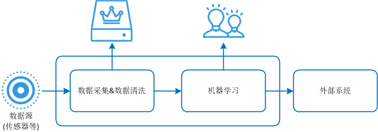

# ML-12:机器学习的通用流程

> 一起创作,Come on!!! [简练而全面的开源ML&AI电子书](https://github.com/media-tm/MTOpenML)

机器学习的通用流程包括：采集原始数据，原始数据来自若干种数据源；清洗数据，清洗数据的目标是将原始数据转换成目标系统的数据并存储；机器学习处理输入数据并输出机器学习决策；机器学习决策输出到外部系统，外部系统做进一步的显示、控制、反馈或通知等链式关联操作。完整流程如下图所示。

下面举一个空想的例子。假如高铁列车的车头流型设计就涉及不下100个设计参数，如何优选100个设计参数，用机器学习搞定这个问题的大致过程是这样的:

- 收集有效车头流型设计案例数据和实验数据；
- 清洗数据、预处理数据并评审车头流型数据集质量；
- 对车头流型数据集进行特征提取,优选显著的数据特征；
- 从机器学习工具箱中优选机器学习算法并评审可行性；
- 使用车头流型数据集训练机器学习模型并评审可信度；
- 使用机器学习模型预估设计参数，给出备选头型设计参数；
- 通过三维流场数值仿真分析和多目标优化，再次优选头型；
- 对优选的头型制作1:8模型，分别进行了多模式风动实验，再次优选头型；
- 对优选的头型试制样车，完成了相关试验验证

## 1 确定问题域

- 我们的数据源是什么？需要确定数据源的物理接口、软件接口、集成方法、数据定义等。
- 我们的数据源是否满足满足项目需求？接入现有机器学习系统的方式和难度系统。
- 针对该项目，我们需要使用数据的具有什么特征？
- 针对该项目，数据的特征和数量是否满足预测的需求？
- 针对该项目，我们使用数据需要做什么预测？如何评估和度量预测的可信度？
- 针对该项目，解决方案如何输出？

## 2 收集并清洗数据集

评估可用的数据源，如传感器系统，外围采集系统，数据库系统，项目指定的第三方系统的可用数据源。(1) 验证数据源是否可用，物理连接接口是否兼容；(2)验证数据源是否可访问，API是否可用；(3) 验证数据源的可集成性，能够有可用解决方案将待评估的数据源接入目标系统，即将待评估数据源的数据格式转换为目标系统数据的格式并存储；(4) 验证数据源的性能和一致性，他们的参数边界是否一致，是否支持并发操作等。通过综合解决方案将待评估数据源接入目标系统后。需要按照目标系统的各种规范清洗数据源，并将清洗后的数据存储到数据库中。

特征工程包括从原始数据中特征构建、特征提取、特征选择。特征工程的核心目标是最大限度的有效使用原始数据，并对机器学习算法的性能和效果有提升。假如我们对特征工程重视程度不够，就像我们设计高层建筑，工程图纸没有设计清楚，高层建筑都不用建起来，我们都会后怕会发生什么？特征工程是机器学习的灵魂，数据预处理、数据清洗、筛选显著特征、摒弃非显著特征等等都非常重要。

## 3 实施机器学习算法

按照任务目标的不同可以将机器学习算法分为回归算法、分类算法和聚类算法。实施机器学习算法简单来说就是：选择模型、优化模型和度量模型性能。

### 3.1 选择模型

机器学习算法有回归算法、分类算法和聚类算法。根据数据的特征和领域经验为基础即可选出合适的机器学习方法。

### 3.2 优化模型

模型诊断中至关重要的是判断过拟合、欠拟合，常见的方法是绘制学习曲线，交叉验证。通过增加训练的数据量、降低模型复杂度来降低过拟合的风险，提高特征的数量和质量、增加模型复杂来防止欠拟合。诊断后的模型需要进行进一步调优，调优后的新模型需要重新诊断，这是一个反复迭代不断逼近的过程，需要不断的尝试，进而达到最优的状态。

### 3.3 度量模型性能

通过测试数据，验证模型的有效性，观察误差样本，分析误差产生的原因，往往能使得我们找到提升算法性能的突破点。误差分析主要是分析出误差来源与数据、特征、算法。必要时使用融合方法提升模型性能。

## 4 发布解决方案

工程上是结果导向，模型在线上运行的效果直接决定模型的成败。 不单纯包括其准确程度、误差等情况，还包括其运行的速度(时间复杂度)、资源消耗程度（空间复杂度）、稳定性是否可接受。

## 参考文献

- [1] 周志华. 机器学习. 清华大学出版社. 2016.
- [2] [日]杉山将. 图解机器学习. 人民邮电出版社. 2015.
- [3] 佩德罗·多明戈斯. 终极算法-机器学习和人工智能如何重塑世界. 中信出版社. 2018.