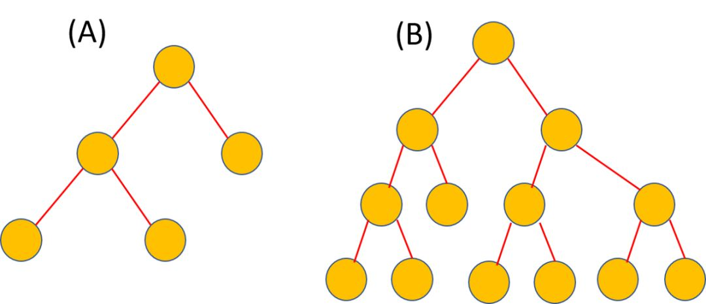
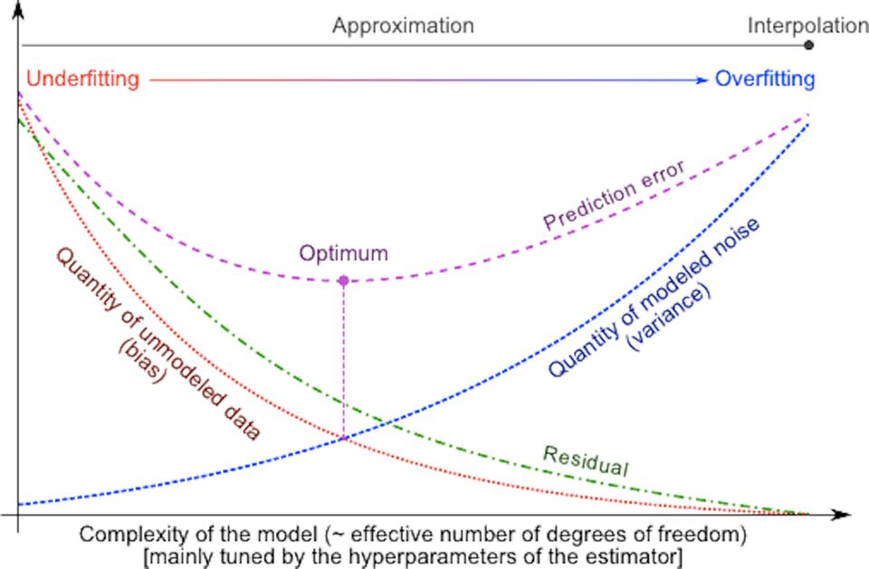

# 机器学习背后的哲学-v1.x

我们很少听到一个三词短语，能将统计学习、信息论和自然哲学的一些核心概念融合到一起。它对于任何有探索兴趣的人来说，都有精确且易于理解的含义，而且对 ML 和数据科学的研究人员，它应该是个有实用性的词。

我说的就是「最小描述长度」（Minimum Description Length）。你可能在想这到底是什么···

让我们拨开层层迷雾，看看它有多有用。

## 统计学中贝叶斯定理

我们从托马斯·贝叶斯牧师开始说起（不按年代），他从未发表过关于统计推理的想法，但他的同名定理却经久不衰。在 18 世纪下半叶，还未曾出现名为「概率论」的数学科学分支。人们知道它，是因为 Abraham de Moievre 写的一本名为《机会学说》的书。1763 年，由贝叶斯撰写的一篇名为《机会问题的解法》的文章，经过 Richard Price 编辑后寄给了英国皇家学会，并发表到《伦敦皇家学会哲学学报》上。在这篇文章中，贝叶斯用一种频率论的方式描述了一个关于联合概率的简单定理，得到了逆概率的计算公式，即贝叶斯定理。

自此统计学科的两个敌对学派——贝叶斯学派和频率学派展开了多次「战争」。但为了本文的目的，让我们暂时忽略历史，把重点放在贝叶斯理论的简单解释上。本文只关注方程。

$P(A|B)=P(B|A)P(A)/P(B)$

该方程本质是：在看到数据/证据（似然度）后更新先验概率，并将更新后的信念程度赋给后验概率。你可以从一个信念开始，但是每个数据点会加强或削弱这个信念，所以会一直更新假设。（假定 A 是某个过程的可能的前提，则 P(A) 是人们事先对前提条件出现可能性大小的估计，称之为先验概率。如果这个过程得到了一个结果 B，那么贝叶斯公式提供了我们根据 B 的出现而对前提条件做出新评估的方法。P(A∣B) 即是对以 B 为前提下 A 的出现概率的重新认识，称 P(A∣B) 为后验概率。）

听起来是不是简单明了？

不过这段话里有个小陷阱，你发现了吗？我漏掉了一个词「假设」。

在统计推理的世界中，假设就是信念。这是关于过程本质的信念（我们无法观察到），它产生于随机变量（有噪声但可观察）。在统计学中，假设被定义为一种概率分布。但在机器学习背景下，它被看做可以产生示例或训练数据的一套规则（或逻辑或过程），我们再从这个神秘过程中学到隐藏的性质。

所以让我们用数据科学的符号来重新定义贝叶斯定理。我们用 D 表示数据，h 表示假设。即应用贝叶斯的公式来确定：在给定数据下，数据由什么假设得到。我们把公式重写为：

$P(h|B)=P(B|h)P(h)/P(B)$

一般来说，我们有一个巨大（通常为无限）的假设空间，可提供很多个假设。贝叶斯推理的本质是，我们检验数据，从而将最可能产生观测数据的假设的概率最大化。我们主要是想确定 P(h|D) 的 argmax 函数，即怎样的 h 使得观测的 D 的概率最大。为了实现这个目的，我们去掉分母 P(D) 的项，因为它不依赖于假设。这个方法被称为最大后验（MAP）。

现在我们应用下面的数学技巧：

- 最大化原函数和最大化取对数的原函数的过程是相似的，即取对数不影响求最大值问题。
- 乘积的对数等于对数的和。
- 正量的最大化等同于负量的最小化。

底数为 2 的负对数项看起来是不是很熟悉？这都来自「信息论」，下面是香农篇。

## 信息论中的香农定理

香农的麻省理工硕士论文在电气工程领域被称为 20 世纪最重要 MS 论文：22 岁的香农在论文中展示了如何利用带继电器和开关的电子电路实现 19 世纪数学家 George Boole 的逻辑代数（布尔代数）。数字计算机设计的最基本的特征是通过开关的打开闭合来表示「真」和「假」、「0」和「1」，并使用电子逻辑门来决定和执行计算——这都可以追溯到香农的论文中。

但这还不是他最伟大的成就。

1941 年，香农前往贝尔实验室从事战争方向的研究，包括密码学。他还在进行信息和通信领域的原创理论研究。在 1948 年，贝尔实验室就此项研究成果发表了一篇著名的论文。

香农定义了源信息量，即通过类似物理中定义热力学熵的公式定义消息中的信息量。用基础术语来说，香农信息熵就是编码信息所需的二进制数，对于概率为 P 的消息或事件，该消息最高效（紧凑）的编码需要-log2(p) 位。

这恰恰是出现在贝叶斯定理中的最大后验表示中的术语的本质。

因此，在贝叶斯推理中，最可能的假设依赖于决定编码长度的两个项，并偏好最小长度。

$h_MAP=arg min[length(D|h)+length(h)]$

但长度是什么概念呢？

## 哲学 Length (h)：奥卡姆剃刀

William Ockham（1287–1347）是一位英国方济会修士和神学家，也是一位非常有影响力的中世纪哲学家。作为一位伟大的逻辑学家，他的名气主要来自于他的格言，也就是众所众知的奥卡姆剃刀。剃刀一词指的是通过「剔除」不必要的假设或消除两个相似的结论来区分两个假设。

他的意思是：若无必要, 勿增实体。用统计学的话说，就是我们必须努力用最简单的假设来解释所有数据。

其他名人也说过类似的原则。

牛顿说：「解释自然界的一切，应该追求使用最少的原理。」

罗素说：「只要可能，就应该用由已知实体组成的构造来代替推导出未知实体的推论。」

人们总喜欢较短的假设。

下图 A 和 B 中，哪个决策树的长度更短？

即使没有一个假设「长度」的准确定义，我相信你会认为左边（A）的树看起来更短。因此，一个更短的假设是说，它有更少的自由参数或者复杂度更低的决策边界（对于分类问题而言），或者是能够表示简洁性的属性的组合。

那 Length(D|h) 又是什么？

它是给定假设的数据长度。什么意思呢？

直观上看，它与假设的正确性或表示能力有关。在给定假设的条件下，它决定了假设「推断」数据的能力。如果假设生成的数据非常理想，我们可以无误的预测出数据，那我们根本不需要数据。

回忆一下牛顿的运动定律。

它们首次以「原理」的形式出现时，背后没有任何的严格数学证明。它们不是定理，而更像基于对自然物体运动的观察而做出的假设。但是它们对数据的描述非常完美。所以它们最终变成了物理定律。

所以当力作用在物体上时，你不需要时刻记住每一刻的加速度数据。你只需要遵循假设的定律 F=ma，并相信根据这个公式，所有你需要的数据都能计算出来。这说明 Length(D|h) 非常小。

但是如果数据经常偏离严格假设，那你就要对这些偏差有一个「长」的描述，以解释这些偏差。

因此，Length(D|h) 简洁地描述了「数据与给定假设的吻合程度」的概念。

它本质上是错误分类或错误率的概念。对于完美的假设，它是短的，在极限情况下为零。对于一个不完全符合数据的假设，它往往比较长。

这是一种权衡。

如果你用奥卡姆的剃刀剔除掉你的假设，你可能会得到一个简单的模型，但该模型不会拟合所有数据。因此，你必须提供更多的数据。另一方面，如果你创建一个复杂且长的假设，训练数据可能会拟合得很好，但这个假设可能（对于其它数据）不正确，因为它违背了具有最小熵假设的最大后验准则。

很像偏差与方差的权衡吗？确实就是 ：-）

## 三者结合

因此，贝叶斯告诉我们，最佳假设是假设长度和错误率之和的最小值。

这个意义重大的句子，几乎囊括了所有（全监督）机器学习。

从这句话延伸开来，可以看到：

线性模型的模型复杂度——选择什么多项式，如何减少平方和的残差。

神经网络的架构选择——如何防止过拟合，达到良好的验证准确率，同时减少分类误差。

支持向量机的正则化和核选择——非线性地权衡准确率和决策边界。

## 结论

从最小描述长度（MDL）的分析中，我们能得出什么结论呢？

这能直接证明短假设是最好的吗？好像不行。

MDL 表明的是，如果选择假设的表示使假设 h 的大小为—log2 P(h)，并且如果选择异常（异常）的表示，则给定 h 的 D 的编码长度是等于—log2 P(D|h)，则 MDL 原则产生 MAP 假设。

然而，为了证明我们有这样的表示，我们必须知道所有先验概率 P(h)，以及 P(D|h)。相对于假设的任意编码和错误/误分类，没有理由优先考虑 MDL 假设。

在实际的机器学习中，对设计者来说，有时获得假设的相对概率表示比完全得到每个假设的绝对概率要容易得多。

在这一点上，领域的专业知识变得极为重要。它缩短了（通常）无限大的假设空间。通过它我们能获得一组可能性更高的假设，我们可以对这些假设优化编码，并找到其中一组最大后验假设。

## 总结和思考

如此简单的数学推导就能在概率论的基本特征上，深刻而简洁地描述监督机器学习的基本限制和目标。为简明扼要地阐述这些问题，读者可以参考论文《为什么机器学习有效》（http://www.cs.cmu.edu/~gmontane/ montanez_. pdf）。这些定理是如何和没有免费午餐定理联系到一起的，同样值得思考。