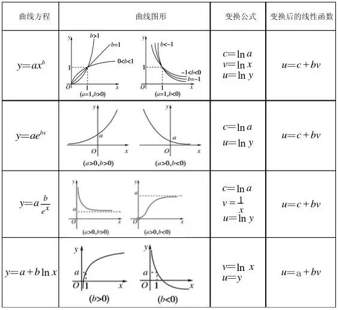

# 非线性回归(Non-linear Regression)算法(含python源码)

> 一起创作,Come on!!! [简练而全面的开源ML&AI电子书](https://github.com/media-tm/MTOpenML)

非线性回归(Non-linear Regression)算法属于有监督的回归(Regression)学习算法。回归(Regression)算法通过建立变量之间的回归模型，通过学习(训练)过程得到变量与因变量之间的相关关系。回归(Regression)分析可以用于预测模型或分类模型。常见的回归算法包括：线性回归(Linear Regression)、非线性回归(Non-linear Regression)、逻辑回归(Logistic Regression)、多项式回归(Polynomial Regression)、岭回归(Ridge Regression)、套索回归(Lasso Regression)和弹性网络回归(ElasticNet Regression)。其中线性回归、非线性回归和逻辑回归最为常用。

很多场合线性模型无法很好的拟合目标数据曲线，这就需要引入非线性回归模式。非线性回归(Non-linear Regression)算法就是将非线性回归转化为线性回归，再按照线性回归求解。线性回归通常采用给定的函数值与模型预测值之差的平方和最小为损失函数, 并使用最小二乘法和梯度下降法来计算最终的拟合参数。

## 1 算法原理

回归(Regression)算法利用巨量观察数据和数理统计方法，尝试建立因变量与自变量之间的回归函数关系，其中当只有因变量及一个自变量时，成为一元回归；当涉及两个或者多个自变量时候，成为多元回归；另外，按照自变量与因变量之间的函数表达式是线性还是非线性，分为线性回归(Linear Regression)和非线性回归(Non-linear Regression)。

自变量与因变量之间的函数表达式的非线性体现在至少有一个变量的指数不是1即(幂函数，指数函数，对数函数，S函数等形式)。值得关注的是部分非线性函数和线性函数有直接的变换关系(见下图)。故可将部分非线性回归转化为线性回归(Linear Regression)的方式来求解非线性回归问题；部分非线性回归无法转化为线性回归但是可以转换成多项式回归(Polynomial Regression)。

线性回归的主要思想就是通过历史数据拟合出一条直线，用这条直线对新的数据进行预测。线性回归的公式如下：  
$h_θ(x)=θ_0+θ_1x_1+θ_2x_2+θ_3x_3...+θ_nx_n=θ^Tx$

从上式可以得出：要想获得一个与目标数据集完美拟合的线性模型，实质就是求解出每个特征自变量的权值θ。线性回归首先构建一个凸函数的优化函数(诸如: 给定的函数值与模型预测值之差的平方和最小)，并使用最小二乘法和梯度下降法来计算最终的拟合参数。

逻辑回归(Logistic Regression)分类算法的核心步骤如下:

- 确定变换函数，将非线性回归转化为线性回归;
- 构造 predict 函数，采用n维线性函数;
- 构造 loss 函数, 给定的函数值与模型预测值之差的平方和最小;
- 使用最小二乘法和梯度下降法计算最终的拟合参数;
- 反复迭代优化最终的拟合参数;
- 输出最终的拟合参数

逻辑回归(Logistic Regression)分类算法的核心优势如下：

- 计算伸缩性: 计算复杂度可控;
- 参数依赖性: 可调节参数较少;
- 普适性能力: 适用于连续型和离散型数据集；
- 抗噪音能力: 对缺失数据和异常数据比较敏感，需要特别关注;
- 结果解释性: 理论简练，解释性好。

## 2 算法实例

略。将非线性回归转化为线性回归需要对数据的深入理解和领域经验；转换为线性函数之后，参考线性回归的代码实现。

## 3 典型应用

非线性回归在定量和定性的数据中有广泛的用途。在线性回归无法取得完美的拟合曲线时，需要引入非线性回归交叉验证。

## 参考资料

- [1] 周志华. 机器学习. 清华大学出版社. 2016.
- [2] [日]杉山将. 图解机器学习. 人民邮电出版社. 2015.
- [3] 佩德罗·多明戈斯. 终极算法-机器学习和人工智能如何重塑世界. 中信出版社. 2018.
- [4] 李航. 统计学习方法. 2012.