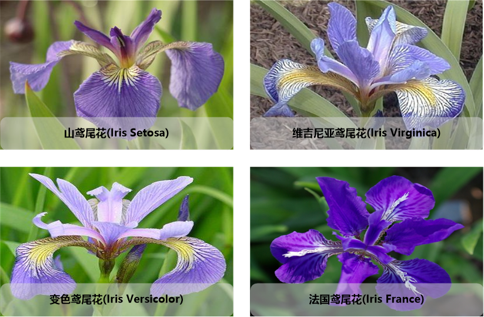
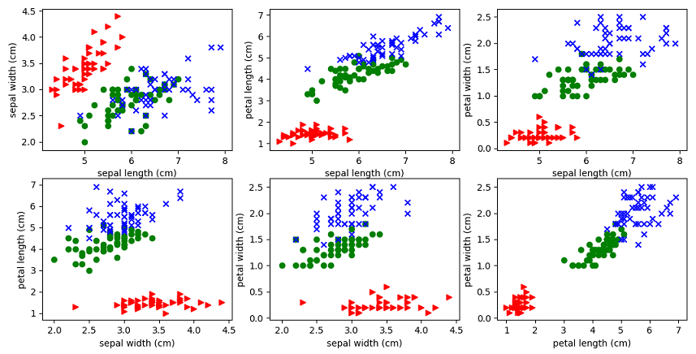

# sklearn的数据集

## 1 鸢尾花(iris)数据集

鸢尾花(yuānwěi)数据集是源自20世纪30年代的经典数据集。它是用统计进行分类的鼻祖。数据包含三个亚属:山鸢尾花(Iris Setosa)、变色鸢尾花(Iris Versicolor)和维吉尼亚鸢尾花(Iris Virginica)。鸢尾花具有四个特征：花萼长度(cm)、花萼宽度(cm)、花瓣长度(cm)、花瓣宽度(cm)，这些形态特征在过去被用来识别物种。



**保存格式**: cvs格式
**数据特征**: 每个样本具有4个特征(sepal length, sepal width, petal length, petal width),特征的单位是cm。一共150个样本。

### 1.1 鸢尾花(iris)数据集操作示例

代码文件位置：../../code-ml/code-sklearn/60-ml-sklearn-dataset.py

``` python
from sklearn.datasets import load_iris
from matplotlib import pyplot as plt

iris_ds = load_iris()

print(iris_ds.keys())
print("iris_ds.keys()  = {0}".format(iris_ds.keys()))

data = iris_ds['data']
print("iris_ds.data.shape  = {0}".format(data.shape))

feature_names = iris_ds['feature_names']
print("data.feature_names  = {0}".format(feature_names))

target = iris_ds['target']
print("data.target.shape = {0}".format(target.shape))

def plot_iris_projection(x_index, y_index):
    # plt.scatter one type of iris flower with one color.
    types_count = 3
    for t,marker,c in zip(range(types_count),'>ox', 'rgb'):
        plt.scatter(data[target==t,x_index],
                    data[target==t,y_index],
                    marker=marker,c=c)
    plt.xlabel(feature_names[x_index])
    plt.ylabel(feature_names[y_index])

pairs = [(0,1),(0,2),(0,3),(1,2),(1,3),(2,3)]
for i,(x_index,y_index) in enumerate(pairs):
    plt.subplot(2,3,i+1)
    plot_iris_projection(x_index, y_index)
plt.show()
```

### 1.2 鸢尾花(iris)数据集图示


