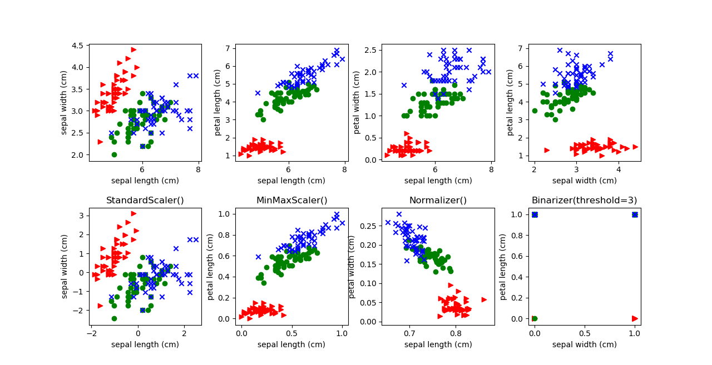
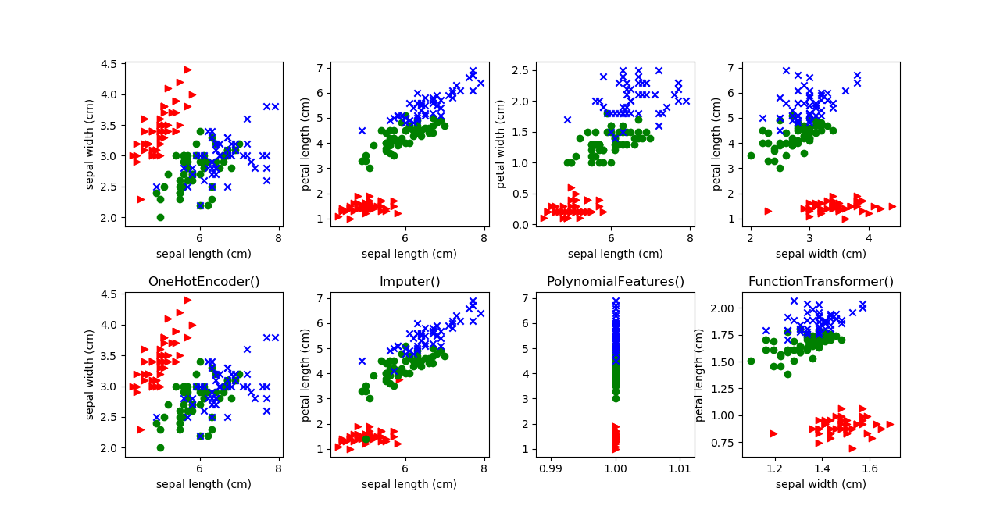
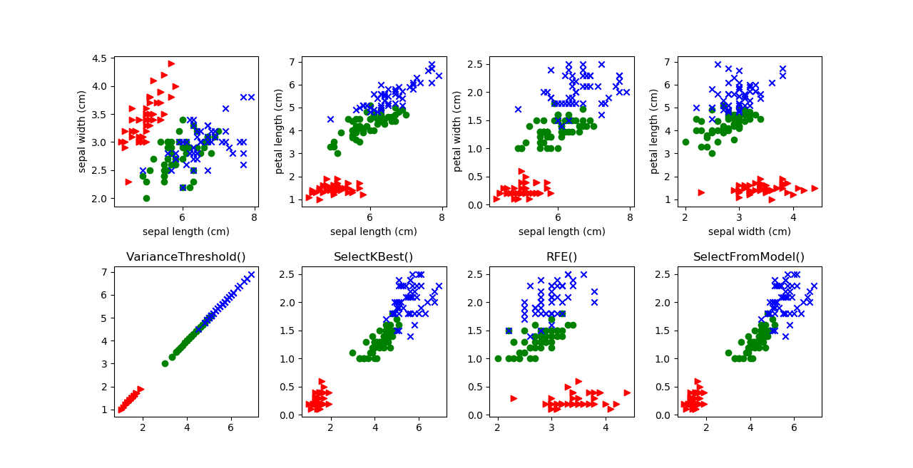
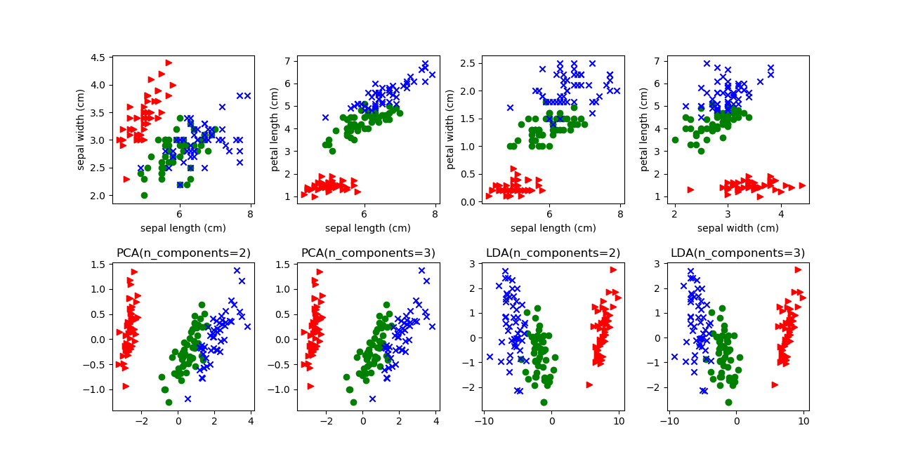

# ML-75:sklearn的特征工程(含python源码)

> 一起创作,Come on!!! [简练而全面的开源ML&AI电子书](https://github.com/media-tm/MTOpenML)

sklearn提供了丰富的特征工程库，特征工程包含:特征预处理、特征降维和特征选择。sklearn的sklearn.preprocessing库支持特征预处理；sklearn的sklearn.decomposition/sklearn.lda库库支持特征降维；sklearn的sklearn.feature_selection库来进行特征选择。

> 数据和特征决定了机器学习的上限，而模型和算法只是逼近这个上限而已。

顾名思义机器学习的核心目的是最大限度地从原始数据中提取特征以供算法和模型使用。特征选取失当，机器学习模型和算法再完美也无力回天。特征工程的重要性占机器学习工程项目80%的工作量。

注意：本文中使用sklearn中的鸢尾花(yuānwěi)数据集来对特征处理功能进行说明。如果不熟悉该数据集请阅读[sklearn的数据集(含python源码)](./71-sklearn-dataset.md)并先了解一下鸢尾花(yuānwěi)数据集。
https://blog.csdn.net/shareviews/article/details/82848530

## 1 特征预处理

没有预处理的数据特征，可能存在下列问题:

- 不属于同一量纲：即特征的规格不一样，使用数据时需要度量转换。
- 存在缺失值：缺失值需要补充。
- 信息冗余：对于某些定量特征(如:分数)，其包含的有效信息为区间划分，可以通过二值化得到定性特征(如:等级)。
- 定性特征不能直接使用：某些机器学习算法和模型只能接受定量特征的输入，那么需要将定性特征转换为定量特征。
- 特征需要变换：不同的机器学习算法和模型对数据有不同的处理能力，通过非线性变换使线性模型具有非线性模型的效果。

使用sklearn中的sklearn.preprocessing库来进行数据预处理，可以覆盖以上问题的解决方案。

鸢尾花(yuānwěi)数据集是源自20世纪30年代的经典数据集。它是用统计进行分类的鼻祖。数据包含三个亚属:山鸢尾花(Iris Setosa)、变色鸢尾花(Iris Versicolor)和维吉尼亚鸢尾花(Iris Virginica)。鸢尾花具有四个特征：花萼长度(cm)、花萼宽度(cm)、花瓣长度(cm)、花瓣宽度(cm)，这些形态特征在过去被用来识别物种。鸢尾花(iris)数据集的数据特征: 每个样本具有4个特征(sepal length, sepal width, petal length, petal width),特征的单位是cm。一共150个样本。

导入iris数据集的代码如下：

``` python
from sklearn.datasets import load_iris
iris = load_iris()
```

### 1.1 特征标准化(无量纲化)

sklearn.preproccessing提供了多种稳健的缩放器或变换器。[sklearn.preproccessing库官方文档](http://scikit-learn.org/stable/modules/preprocessing.html)

#### 1.1.1 标准化

标准化需要计算特征的均值和标准差。标准化是依照特征矩阵的列处理数据，其通过求z-score的方法，将样本的特征值转换到同一量纲下。

使用sklearn.preproccessing库的MinMaxScaler类对数据进行区间缩放的代码如下：

``` python
from sklearn.preprocessing import StandardScaler
StandardScaler().fit_transform(iris.data)
```

#### 1.1.2 区间缩放法

区间缩放法的思路有多种，常见的一种为利用两个最值进行缩放。

使用sklearn.preproccessing库的MinMaxScaler类对数据进行区间缩放的代码如下：

``` python
from sklearn.preprocessing import StandardScaler
StandardScaler().fit_transform(iris.data)
```

#### 1.1.3 规范化

归一化是将单个样本缩放为具有单位范数的过程，其目的在于样本向量在点乘运算或其他核函数计算相似性时，拥有统一的标准。归一化常用于文本分类和聚类上下文的向量空间模型。

使用sklearn.preproccessing库的Normalizer类对数据进行归一化的代码如下：

``` python
from sklearn.preprocessing import Normalizer
Normalizer().fit_transform(iris.data)
```

### 1.2 定量特征的二值化

特征二值化是对数值特征进行阈值处理以获得布尔值的过程。使用二进制特征值可能简化概率推理。

定量特征二值化的核心在于设定一个阈值，大于阈值的赋值为1，小于等于阈值的赋值为0。

使用sklearn.preproccessing库的Binarizer类对数据进行二值化的代码如下：

``` python
from sklearn.preprocessing import Binarizer
Binarizer(threshold=3).fit_transform(iris.data)
```



### 1.3 定性特征的哑编码

由于iris数据集的特征皆为定量特征，故使用其目标值进行哑编码（实际上是不需要的）。使用sklearn.preproccessing库的OneHotEncoder类对数据进行哑编码的代码如下：

``` python
from sklearn.preprocessing import OneHotEncoder
OneHotEncoder().fit_transform(iris.target.reshape((-1,1)))
```

### 1.4 预处理缺失值

使用不完整数据集的基本策略是丢弃包含缺失值的整个行和/或列。然而，这是以丢失可能有价值的数据（即使不完整）为代价的。更好的策略是估算缺失值，即从数据的已知部分推断它们。
对于不完整的数据集，针对包含缺失值的整个行和/或列有2中基本的处理策略。(1) 丢弃包含缺失值的整个行和/或列; (2) 估算缺失值, 即使用平均数，中位数或其中缺失值所在的行或列的最频繁的值补全缺失数据。

由于iris数据集没有缺失值，故添加一条包含缺失值的记录。使用sklearn.preproccessing库的Imputer类对数据进行缺失值计算的代码如下：

``` python
from numpy import vstack, array, nan
from sklearn.preprocessing import Imputer
# The parameter strategy is the missing value filling method. The default is mean.
Imputer().fit_transform(vstack((array([nan, nan, nan, nan]), iris.data)))
```

### 1.5 数据变换

常见的数据变换有基于多项式的、基于指数函数的、基于对数函数的。也可以基于FunctionTransformer实现自定义变换器。

#### 1.5.1 多项式变换

使用sklearn.preproccessing库的PolynomialFeatures类对数据进行多项式转换的代码如下：

``` python
from sklearn.preprocessing import PolynomialFeatures
PolynomialFeatures().fit_transform(iris.data)
```

#### 1.5.2 单变元函数变换(自定义变换)

可以使用任意函数实现变换器FunctionTransformer，以帮助我们进行数据清理或处理。基于单变元函数的数据变换可以使用sklearn.preproccessing库的FunctionTransformer对数据进行对数函数转换的代码如下：

``` python
from numpy import log1p
from sklearn.preprocessing import FunctionTransformer
FunctionTransformer(log1p).fit_transform(iris.data)
```



## 2 特征选择

当数据预处理完成后，我们需要优选数据特征以最大化机器学习算法的性能。特征选择过程可以从以下两个角度考虑:

- 特征是否发散：优选发散的样本特征，否则不利于区分样本。
- 特征与目标的相关性：优选与目标相关性高的特征。

特征选择根据特征选择的形式不同可分为3中类型: 过滤法(Filter)、包装法(Wrapper)和嵌入法(Embedded)。
根据特征选择的形式又可以将特征选择方法分为3种：

- 过滤法：按照发散性或者相关性对各个特征进行评分，然后选择特征;
- 包装法：根据目标函数(如预测效果)评分，每次选择若干特征;
- 嵌入法: 先使用某些机器学习的算法和模型进行训练，得到各个特征的权值系数，根据系数从大到小选择特征。

我们使用sklearn中的feature_selection库来进行特征选择。[sklearn.feature_selection库官方文档](http://scikit-learn.org/stable/modules/feature_selection.html)。

### 2.1 过滤法(Filter)

### 2.1.1 方差选择法

使用方差选择法，先要计算各个特征的方差，然后根据阈值，选择方差大于阈值的特征。使用sklearn.feature_selection库的VarianceThreshold类来选择特征的代码如下：

``` python
from sklearn.feature_selection import VarianceThreshold
VarianceThreshold(threshold=3).fit_transform(iris.data)
```

### 2.1.2 相关系数法

使用相关系数法，先要计算各个特征对目标值的相关系数以及相关系数的P值。用sklearn.feature_selection库的SelectKBest类结合相关系数来选择特征的代码如下：

``` python
from sklearn.feature_selection import SelectKBest
from scipy.stats import pearsonr
# k is number of features
SelectKBest(lambda X, Y: array(map(lambda x:pearsonr(x, Y), X.T)).T, k=2).fit_transform(iris.data, iris.target)
```

### 2.1.3 卡方检验

经典的卡方检验是检验定性自变量对定性因变量的相关性。用sklearn.feature_selection库的SelectKBest类结合卡方检验来选择特征的代码如下：

``` python
from sklearn.feature_selection import SelectKBest
from sklearn.feature_selection import chi2
# k is number of features
SelectKBest(chi2, k=2).fit_transform(iris.data, iris.target)
```

### 2.1.4 互信息法

经典的互信息也是评价定性自变量对定性因变量的相关性的。

### 2.2 包装法(Wrapper)

递归消除特征法使用一个基模型来进行多轮训练，每轮训练后，消除若干权值系数的特征，再基于新的特征集进行下一轮训练。使用sklearn.feature_selection库的RFE类来选择特征的代码如下:

``` python
from sklearn.feature_selection import RFE
from sklearn.linear_model import LogisticRegression
# n_features_to_select is number of features
RFE(estimator=LogisticRegression(), n_features_to_select=2).fit_transform(iris.data, iris.target)
```

### 2.3 嵌入法(Embedded)

#### 2.3.1 基于惩罚项的特征选择法

使用带惩罚项的基模型，除了筛选出特征外，同时也进行了降维。使用sklearn.feature_selection库的SelectFromModel类结合带L1惩罚项的逻辑回归模型，来选择特征的代码如下：

``` python
from sklearn.feature_selection import SelectFromModel
from sklearn.linear_model import LogisticRegression
# Logistic regression with L1 penalty
SelectFromModel(LogisticRegression(penalty="l1", C=0.1)).fit_transform(iris.data, iris.target)
```

#### 2.3.2 基于树模型的特征选择法

树模型中GBDT也可用来作为基模型进行特征选择，使用feature_selection库的SelectFromModel类结合GBDT模型，来选择特征的代码如下：

``` python
from sklearn.feature_selection import SelectFromModel
from sklearn.ensemble import GradientBoostingClassifier
# Feature selection of GBDT as a base model
SelectFromModel(GradientBoostingClassifier()).fit_transform(iris.data, iris.target)
```



## 3 特征降维

部分机器学习项目，由于数据集特征矩阵过大，导致计算量大，训练时间长的问题，因此降低特征矩阵维度也是必不可少的。常见的降维方法包括:基于L1惩罚项的模型、主成分分析法(PCA)和线性判别分析(LDA)。降维的本质就是将原始的样本映射到维度更低的样本空间中。PCA是为了让映射后的样本具有最大的发散性；而LDA是为了让映射后的样本有最好的分类性能。所以说PCA是一种无监督的降维方法，而LDA是一种有监督的降维方法。

### 3.1 主成分分析法(PCA)

使用sklearn.decomposition库的PCA类选择特征的代码如下：

``` python
from sklearn.decomposition import PCA
# n_components is the dimensionality after dimension reduction.
PCA(n_components=2).fit_transform(iris.data)
```

### 3.2 线性判别分析(LDA)

使用sklearn.lda库的LDA类选择特征的代码如下：

``` python
from sklearn.lda import LDA
# n_components is the dimensionality after dimension reduction.
LDA(n_components=2).fit_transform(iris.data, iris.target)
```



## 参考资料

- [1] 周志华. 机器学习. 清华大学出版社. 2016.
- [2] [日]杉山将. 图解机器学习. 人民邮电出版社. 2015.
- [3] 佩德罗·多明戈斯. 终极算法-机器学习和人工智能如何重塑世界. 中信出版社. 2018.
- [4] [sklearn.preproccessing库官方文档](http://scikit-learn.org/stable/modules/preprocessing.html)
- [5] [sklearn.feature_selection库官方文档](http://scikit-learn.org/stable/modules/feature_selection.html)
- [4] [使用Sklearn做特征工程](https://www.jianshu.com/p/78e49de61934)